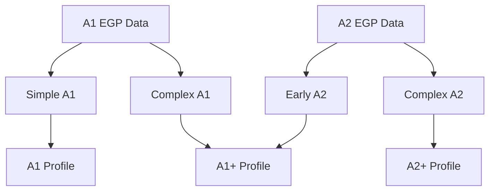

# EGP Level Profile Architecture Design (S3 Scan)

## 1. Grammar Data Scan Analysis

Based on the import process completed in S2, the English Grammar Profile (EGP) dataset contains **1,222 records** with the following characteristics:

### CEFR Level Distribution
*   **A1:** 109 records (8.9%)
*   **A2:** 291 records (23.8%)
*   **B1:** 338 records (27.7%)
*   **B2:** 243 records (19.9%)
*   **C1:** 129 records (10.6%)
*   **C2:** 112 records (9.2%) — *Inactive/Excluded from active generation by default*

### Super Category Distribution
There are **19 unique super categories** in the EGP dataset, reflecting different grammatical domains. The top 5 super categories represent over 57% of all records:
1.  **MODALITY** (239 records) — Highest frequency, dominates B1 and B2 levels.
2.  **CLAUSES** (135 records) — Key indicator of syntactic complexity.
3.  **PRONOUNS** (119 records) — Heavy presence in lower levels (A1–A2).
4.  **PAST** (93 records) — Critical tense markers for narrative progress.
5.  **ADJECTIVES** (79 records) — Modifier structures.

### Lexical Range Distribution
Lexical range values are mapped as follows:
*   **Empty (Default/Not specified):** 991 records (81.1%)
*   **1 (Basic):** 99 records (8.1%) — Concentrated in A1 (26) and A2 (47).
*   **2 (Intermediate):** 90 records (7.4%) — Concentrated in A2 (24) and B1 (44).
*   **3 (Advanced):** 42 records (3.4%) — Concentrated in B1 (9), B2 (17), and C1 (11).

---

## 2. Proposed Level Profile Schema

Each level profile (from A1 to C1, including plus levels) will be configured as a JSON document in `level_profiles/{level}.json`. The proposed schema includes:

```json
{
  "level": "A1_plus",
  "cefr_base": "A1",
  "theme_level": "A1_plus",
  "active": true,
  "sentence_length_min": 5,
  "sentence_length_max": 12,
  "allowed_grammar_ids": [
    "1741163706316x926291459998112000"
  ],
  "candidate_grammar_ids": [
    "1741163706316x198445876411383900"
  ],
  "blocked_grammar_ids": [
    "1741163706317x106352194611554880"
  ],
  "allowed_super_categories": [
    "ADJECTIVES",
    "PRONOUNS",
    "PRESENT",
    "PAST"
  ],
  "allowed_sub_categories": [
    "combining",
    "personal"
  ],
  "blocked_super_categories": [
    "PASSIVES",
    "REPORTED SPEECH",
    "FOCUS"
  ],
  "blocked_sub_categories": [],
  "allowed_connectors": [
    "and",
    "but",
    "or",
    "because",
    "so"
  ],
  "blocked_connectors": [
    "although",
    "however",
    "nevertheless"
  ],
  "allowed_tenses": [
    "present_simple",
    "present_continuous",
    "past_simple"
  ],
  "blocked_tenses": [
    "present_perfect",
    "past_perfect",
    "future_perfect"
  ],
  "validation_rules": {
    "max_clauses_per_sentence": 2,
    "max_syllables_per_word": 3,
    "vocabulary_ceiling_level": "A2"
  },
  "generation_rules": {
    "prompt_instructions": "Use short sentences. Introduce simple past tense and basic cause/effect logical connectors like 'because' and 'so'. Avoid passive structures.",
    "temperature": 0.3
  },
  "media_rules": {
    "tts_voice_gender": "female",
    "tts_speed_rate": 0.85,
    "image_complexity": "simple_flat"
  }
}
```

### Schema Field Definitions:
1.  `level` (string): Unique identifier of the level profile.
2.  `cefr_base` (string): The base CEFR level (A1, A2, B1, B2, C1).
3.  `theme_level` (string): The key mapping to themes in `theme_mapping.json`.
4.  `active` (boolean): Flag to toggle whether this level is used in active content generation.
5.  `sentence_length_min` (integer): Minimum number of words per generated sentence.
6.  `sentence_length_max` (integer): Maximum number of words per generated sentence.
7.  `allowed_grammar_ids` (array of strings): EGP grammar record IDs explicitly allowed for this level.
8.  `candidate_grammar_ids` (array of strings): Potential grammar items under evaluation for this level (crucial for plus-level selection).
9.  `blocked_grammar_ids` (array of strings): Grammar record IDs explicitly banned from appearing in generated content.
10. `allowed_super_categories` (array of strings): Broad grammatical domains allowed (e.g. `PAST`).
11. `allowed_sub_categories` (array of strings): Specific subdomains allowed.
12. `blocked_super_categories` (array of strings): Grammatical domains completely banned (e.g. `PASSIVES` in A1).
13. `blocked_sub_categories` (array of strings): Specific subdomains banned.
14. `allowed_connectors` (array of strings): Allowable conjunctions or linking words.
15. `blocked_connectors` (array of strings): Banned conjunctions or linking words.
16. `allowed_tenses` (array of strings): Allowable verb tenses.
17. `blocked_tenses` (array of strings): Banned verb tenses.
18. `validation_rules` (object): Thresholds used by validators to verify generated text files.
19. `generation_rules` (object): System instructions appended to generator prompts.
20. `media_rules` (object): Audio (TTS) and image generation constraints.

---

## 3. Plus-Level Split Strategy

Plus levels (A1+, A2+, B1+, B2+) do not exist natively in the EGP spreadsheet. They must be constructed by selectively splitting and borrowing grammar items.



### Split Criteria
The split strategy relies on three quantifiable criteria:
1.  **Syntactic Complexity:** Structures introducing clauses (e.g. subordinate clauses, relative clauses) or multiple modifiers.
2.  **Lexical Range:** Records containing `lexical_range` tags are split. Lower ranges remain in base levels, higher ranges are moved to plus levels.
3.  **Tense Progression:** Base levels focus on simple/present states. Plus levels introduce completed past events or predictive future actions.

### Split Implementations:

#### A1+ (Bridge to A2)
*   **From Upper/Complex A1:** Combining adjectives with 'but' (A1 has 2 records, A1+ takes the complex one), basic past time markers.
*   **From Safe Early A2:** Simple past tense introduction (e.g. irregular verbs), future intentions ('going to'), basic causal connectors ('because').

#### A2+ (Bridge to B1)
*   **From Upper/Complex A2:** Relative clauses using 'who' or 'which', comparative forms with 'more/less', past continuous introduction.
*   **From Safe Early B1:** Present perfect for life experiences ('have you ever...'), first conditional forms, modal verbs of possibility ('may', 'might').

#### B1+ (Bridge to B2)
*   **From Upper/Complex B1:** Second conditional forms, present perfect continuous, basic passive voice structures.
*   **From Safe Early B2:** Second/third conditional combinations, modal verbs of deduction ('must have been'), complex clause connectors ('although', 'despite').

#### B2+ (Bridge to C1)
*   **From Upper/Complex B2:** Past perfect continuous, active/passive voice switching, nominal relative clauses ('what I want is...').
*   **From Safe Early C1:** Inversion structures, subjunctive mood forms, advanced cohesive discourse markers.

---

## 4. Unresolved Issues & Risks

### Issue 1: Defining A1+ and A2+ Boundaries
*   **Problem:** If we borrow too many A2 grammar items for A1+, the distinction between A1+ and A2 becomes blurry.
*   **Risk:** Generation tasks for A1+ and A2 might produce text of identical complexity.
*   **Recommendation:** Limit borrowed items to a small list of "Early Candidates" (max 15% of the next level's pool) and strictly enforce sentence length limits (A1+ max 12 words, A2 max 15 words).

### Issue 2: Defining B1+ and B2+ Boundaries
*   **Problem:** B1 and B2 contain massive MODALITY and CLAUSES subsets (MODALITY has 67 in B1, 55 in B2; CLAUSES has 43 in B1, 20 in B2).
*   **Risk:** The sheer volume of modality structures makes manual classification tedious.
*   **Recommendation:** Categorize based on the semantic target. B1+ should focus on opinion-sharing and logical reasoning (e.g. conditional sentences). B2+ should focus on formal debate, academic reports, and professional discourse.

### Issue 3: Status of C2
*   **Problem:** The EGP dataset contains 112 C2 records, but the theme mapping file (`docs/A1_C1_情境.txt`) stops at C1.
*   **Recommendation:** C2 records should be imported and kept in the database for integrity, but their profile should remain `active: false` to prevent active content generation. They can be reviewed in a future milestone (S5+).

### Issue 4: Handling the 4 Warning Rows
*   **Problem:** Rows 214, 422, 838, and 1001 are missing both their `Can-do statement` and `Example` fields in the EGP source.
*   **Risk:** Downstream generators relying on these fields to create writing prompts will fail or generate gibberish.
*   **Recommendation:**
    1.  Keep them in `grammar_profile.json` with empty fields and `import_warnings` flags to preserve row counts.
    2.  Explicitly list their IDs in the `blocked_grammar_ids` of every level profile to ensure they are never passed to generators.

---

## 5. Readiness for EGP_DB_S4_LevelProfile_Fix

This project is **fully ready** to transition to the implementation phase (S4). 
*   All raw inputs are normalized and stored in consistent JSON formats.
*   The schema and split rules have been defined and validated against actual EGP content data.
*   No structural changes to `grammar_profile.json` are required, keeping it read-only.
*   Next step: Write a script (`tools/create_level_profiles.py`) that uses these rules to generate the individual JSON files under `level_profiles/`.
