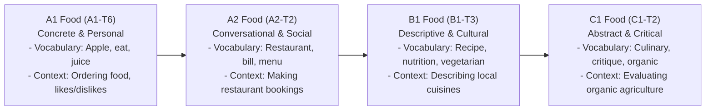

# CEFR Theme Progression Design (THEME_DB_S0)

This document designs the progression framework for core communicative themes across CEFR levels. Learners progress from simple, concrete structures (A1) to abstract, complex debates (C1).

---

## 1. Food and Dining Progression

---

## 2. Travel and Transportation Progression

*   **A1 Travel (A1-T8):**
    *   *Focus:* Transportation naming, simple weather.
    *   *Vocabulary:* Train, plane, bus, sunny, hot.
    *   *Context:* Saying "I go to school by bus" or "It is sunny today."
*   **A2 Travel (A2-T2):**
    *   *Focus:* Travel logistics, direction asking.
    *   *Vocabulary:* Ticket, luggage, flight, turn left.
    *   *Context:* Asking "Where is the train station?" and buying a ticket.
*   **B1 Travel (B1-T1):**
    *   *Focus:* Travel emergencies and customer complaints.
    *   *Vocabulary:* Refund, delay, cancel, passport.
    *   *Context:* Negotiating a refund at an airport or handling a lost passport.
*   **C1 Travel (C1-T2):**
    *   *Focus:* Intercultural commentary and abstract travel narratives.
    *   *Vocabulary:* Wanderlust, cultural assimilation, itinerary.
    *   *Context:* Discussing the impact of tourism on local communities.

---

## 3. Work and Careers Progression

*   **A1 Careers (A1-T1):**
    *   *Focus:* Family jobs.
    *   *Vocabulary:* Teacher, doctor, work.
    *   *Context:* Saying "My father is a doctor."
*   **A2 Careers (A2-T1):**
    *   *Focus:* Job duties and local office settings.
    *   *Vocabulary:* Office, manager, uniform.
    *   *Context:* Describing daily tasks at work.
*   **B1 Careers (B1-T2):**
    *   *Focus:* Professional letter writing and meetings.
    *   *Vocabulary:* Meeting, report, customer service.
    *   *Context:* Brainstorming in meetings and drafting a sales email.
*   **B2 Careers (B2-T1/T2):**
    *   *Focus:* Corporate policy debates and technical field reviews.
    *   *Vocabulary:* Strategy, efficiency, analyze.
    *   *Context:* Debating company cost-cutting or technology implementation.
*   **C1 Careers (C1-T1):**
    *   *Focus:* Negotiation, leadership, and crisis management.
    *   *Vocabulary:* Leverage, concession, hostile.
    *   *Context:* Leading board negotiations or answering hostile press questions.

---

## 4. Socializing and Relationships Progression

*   **A1 Socializing (A1-T1):**
    *   *Focus:* Greetings and introductions.
    *   *Vocabulary:* Hello, friend, family.
    *   *Context:* Basic "How are you?" greetings.
*   **A2 Socializing (A2-T3):**
    *   *Focus:* Inviting and scheduling.
    *   *Vocabulary:* Invite, party, weekend.
    *   *Context:* Inviting a friend to a weekend party.
*   **B1 Socializing (B1-T3):**
    *   *Focus:* Personal dreams and cultural sharing.
    *   *Vocabulary:* Dream, hobby, opinion, concert.
    *   *Context:* Sharing views on a movie or music album.
*   **C1 Socializing (C1-T1/T2):**
    *   *Focus:* Implicit communication and humor.
    *   *Vocabulary:* Irony, sarcasm, nuance, critique.
    *   *Context:* Navigating sophisticated social gatherings and detecting sarcasm.
