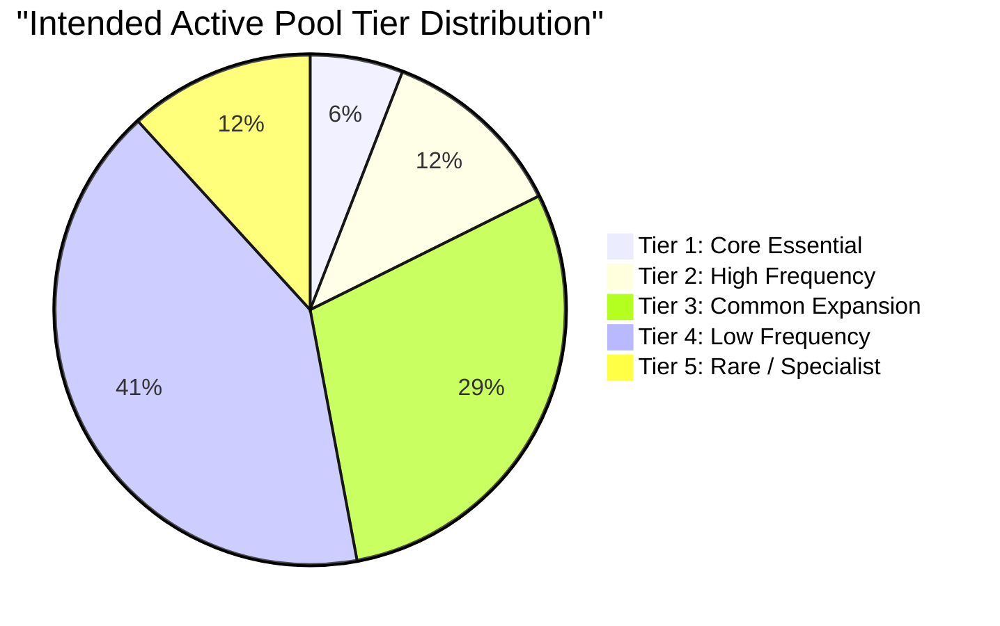

# Vocabulary Frequency Band Design (VOCAB_DB_S0C)

This document defines the standard vocabulary frequency bands (Tiers 1–5) to be used for content generation, distractors selection, and student level assessments.

---

## 1. Frequency Tiers Specification

### Tier 1: Core Essential
*   **Corpus Range:** Top 1,000 words (lemmas) in the reference corpus.
*   **Intended Learner Usage:** Absolute baseline survival vocabulary. Must represent the primary lexical pool for A1 and A1+ learners. Covers standard function words, primary verbs, and daily objects.
*   **Sampling Weight:** 1.0 (Base weight in generators).
*   **Generation Priority:** Critical. Generators must exhaustively use Tier 1 words before introducing higher tiers.

### Tier 2: High Frequency
*   **Corpus Range:** Words 1,001 to 3,000.
*   **Intended Learner Usage:** Essential for everyday conversational fluency. Extends vocabulary to cover secondary verbs, core adjectives, and typical situational terms (travel, shopping, work). Essential for A2 and A2+ learners.
*   **Sampling Weight:** 0.8.
*   **Generation Priority:** High.

### Tier 3: Common Expansion
*   **Corpus Range:** Words 3,001 to 8,000.
*   **Intended Learner Usage:** Enables reading of standard texts (news, simple stories) and participation in structured discussions. Widely used in B1 and B1+ curricula.
*   **Sampling Weight:** 0.5.
*   **Generation Priority:** Medium.

### Tier 4: Low Frequency
*   **Corpus Range:** Words 8,001 to 15,000.
*   **Intended Learner Usage:** Focuses on stylistic variation, abstract synonyms, and technical/business contexts. Relevant for B2, B2+, and C1 learners to achieve higher academic proficiency.
*   **Sampling Weight:** 0.2.
*   **Generation Priority:** Low.

### Tier 5: Rare / Specialist
*   **Corpus Range:** Words 15,001+ or terms not appearing in the baseline corpus (e.g., highly specialized terms or rare idioms).
*   **Intended Learner Usage:** Receptive/passive vocabulary for advanced academic research (C1+). Excluded from active student production by default.
*   **Sampling Weight:** 0.05 (or 0.0 by default in lower levels).
*   **Generation Priority:** Very Low (used only as contextual "exposure" words in advanced reading texts).

---

## 2. Band Distribution and Active Counts

In the future implementation, words in `vocabulary.json` will be assigned to a tier based on their corpus rank:

This mapping allows the system to differentiate between an A1 word that is common (e.g. `house` - Tier 1) vs an A1 word that is less common (e.g. `skirt` - Tier 2/3), ensuring natural-sounding language is generated first.
