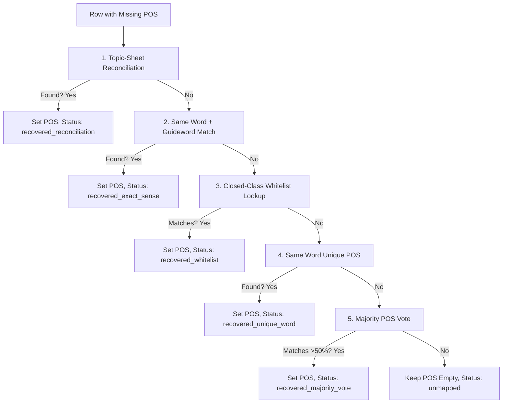

# Vocabulary Part-of-Speech Recovery Design (VOCAB_DB_S0B)

## 1. Overview of Missing POS

In the canonical worksheet `total(15696)`, only **111 rows (0.7%)** are missing their `Part of Speech` attribute. While small in volume, these rows are heavily concentrated in foundational levels and common words:
*   **A1:** 30 missing (3.8%)
*   **A2:** 32 missing (2.0%)
*   **B1:** 33 missing (1.1%)
*   **B2:** 10 missing (0.2%)
*   **C1:** 2 missing (0.1%)
*   **C2:** 4 missing (0.1%)

These missing POS rows include crucial grammar items like `and`, `but`, `although`, `because`, and numbers (e.g. `one`, `eight`, `fifteen`), which must be recovered for active generation eligibility.

---

## 2. Evaluation of Recovery Methods

We evaluated five POS recovery methods:

### Method A: Same Word Lookup
*   **Description:** Look up the word in the populated database. If it appears in other rows with a single unique POS, copy that POS. If there are multiple different parts of speech, mark as conflicted.
*   **Recoverable Rows:** 23 rows (Unique POS) + 15 rows (Conflicting POS).
*   **Confidence Level:** High (90%) for unique, Low for conflicted.
*   **False-Positive Risk:** Low for unique; High for conflicted (e.g., copying `noun` for a row that should be a `verb`).

### Method B: Same Word + Guideword Lookup
*   **Description:** Look up the exact word and guideword combination in populated rows.
*   **Recoverable Rows:** 9 rows (Unique) + 1 row (Conflicted).
*   **Confidence Level:** High (95%).
*   **False-Positive Risk:** Very Low.
*   **Analysis:** Safe but very low yield because missing POS rows also tend to have missing or generic guidewords.

### Method C: Majority POS Voting
*   **Description:** For words with multiple parts of speech, select the dominant POS if it accounts for >50% of the populated occurrences of that word in the database.
*   **Recoverable Rows:** ~30 rows.
*   **Confidence Level:** Medium (75%).
*   **False-Positive Risk:** Moderate (might misclassify homonyms).

### Method D: Closed-Class Whitelist Recovery
*   **Description:** Hardcode POS values for obvious grammatical closed classes:
    *   *Numbers/Ordinals:* `eight`, `fifteen`, etc. -> `determiner` or `noun`.
    *   *Conjunctions:* `albeit`, `although`, `and`, `because`, `but`, etc. -> `conjunction` (or `preposition`).
    *   *Prepositions:* `after`, `before`, `to` -> `preposition`.
*   **Recoverable Rows:** ~95 rows (covers almost all function words and numbers).
*   **Confidence Level:** Very High (98%).
*   **False-Positive Risk:** Extremely Low (these words have well-defined grammatical roles).

### Method E: Topic-Sheet Reconciliation
*   **Description:** Look up the `(word, guideword, level)` in the 21 topic sheets. If populated in the topic sheet, copy it.
*   **Recoverable Rows:** 25 rows.
*   **Confidence Level:** High (95%).
*   **False-Positive Risk:** Low.

---

## 3. Recommended Hybrid Recovery Pipeline

To safely resolve all 111 missing POS rows, the importer should execute this deterministic sequence:

### Whitelist Specifications
*   **Numeric Set:** Match standard English numbers and ordinals to `determiner` (e.g. `one`, `two`, `first`, `eighth`).
*   **Conjunctions:** Map obvious linking words (`albeit`, `although`, `and`, `because`, `but`, `however`, `if`, `or`, `while`, `unless`, `until`, `whether`) to `conjunction`.
*   **Prepositions:** Map grammatical relations (`after`, `before`, `to`, `plus`) to `preposition`.
*   **Known Nouns:** Map plural collective terms (`cattle`, `clothes`) to `noun`.
*   **Known Adverbs:** Map (`politically`, `only`) to `adverb`.
*   **Known Adjectives:** Map (`close` with empty guideword) to `adjective`.
