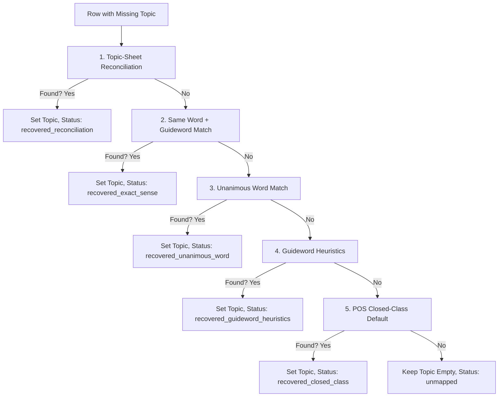

# Vocabulary Topic Recovery Design (VOCAB_DB_S0B)

## 1. Overview of Missing Topics

In the canonical worksheet `total(15696)`, **8,794 rows (56.0%)** are missing their `Topic` attribute. The missing topic rate is extremely high in advanced levels:
*   **A1:** 306 missing (39.0%)
*   **A2:** 625 missing (39.2%)
*   **B1:** 1,274 missing (43.4%)
*   **B2:** 1,907 missing (45.8%)
*   **C1:** 1,772 missing (73.5%)
*   **C2:** 2,910 missing (76.4%)

Without a recovery strategy, these rows will be blocked from active generation, drastically reducing the vocabulary pool size.

---

## 2. Evaluation of Recovery Methods

We evaluated six different topic recovery methods:

### Method A: Topic-Sheet Reconciliation
*   **Description:** Look up the composite key `(word, guideword, level, part_of_speech)` in the 21 topic sheets and assign the sheet's topic.
*   **Recoverable Rows:** 34 rows.
*   **Confidence Level:** High (99%).
*   **False-Positive Risk:** Very Low.
*   **Analysis:** The sum of all rows in the topic sheets is exactly 6,902, which is the exact number of populated topic rows in the `total` sheet. Thus, the topic sheets are simply a partition of the populated rows, yielding almost zero new recovery.

### Method B: Same Word + Same Guideword Lookup
*   **Description:** Match a missing-topic row with a populated-topic row in the `total` sheet sharing the exact same `Base Word` and `Guideword`.
*   **Recoverable Rows:** 173 rows.
*   **Confidence Level:** High (95%).
*   **False-Positive Risk:** Low.
*   **Analysis:** Safe and highly specific, as it matches identical lexical senses, but has a low yield due to the high volume of empty guidewords in missing-topic rows.

### Method C: Majority-Topic Voting
*   **Description:** Find all populated-topic rows for the same `Base Word`. If there is a dominant topic (e.g. >50% or 100% agreement), copy that topic.
*   **Recoverable Rows:**
    *   *Unanimous (100% agreement):* 1,598 rows.
    *   *Majority (>50% agreement):* 1,782 rows.
*   **Confidence Level:**
    *   *Unanimous:* High (90%).
    *   *Majority:* Medium-High (80%).
*   **False-Positive Risk:** Moderate. Homonyms with different meanings (e.g., `bank` as "river bank" vs "financial bank") might be mismapped if they share the same base word.

### Method D: Guideword Heuristic Mapping
*   **Description:** Run keyword searches on the `Guideword` text (e.g. `MONEY` -> `money`, `ANIMAL` -> `animals`, etc.).
*   **Recoverable Rows:** ~220 rows (across major categories like money, animals, clothes, health, food, travel, work, and crime).
*   **Confidence Level:** High (90%).
*   **False-Positive Risk:** Low to Moderate. Only applicable to the 4,061 missing-topic rows that have non-empty guidewords.

### Method E: POS-Aware Closed-Class Mapping
*   **Description:** Map closed-class grammatical words (determiners, pronouns, prepositions, conjunctions, modal verbs, auxiliary verbs) with missing topics to a functional category like `describing things` or `communication`.
*   **Recoverable Rows:** ~480 rows.
*   **Confidence Level:** Medium (75%).
*   **False-Positive Risk:** Moderate. While semantically distinct, mapping all prepositions to `describing things` is linguistically sound as they represent functional grammar rather than lexical topics.

### Method F: Hybrid Recovery Pipeline (Recommended)
*   **Description:** A sequenced pipeline executing:
    1.  Topic-sheet reconciliation (Method A).
    2.  Same word + same guideword lookup (Method B).
    3.  Unanimous word majority vote (Method C).
    4.  Guideword keyword heuristics (Method D).
    5.  POS-aware closed-class mapping (Method E).
*   **Recoverable Rows:** ~2,300+ rows total.
*   **Confidence Level:** High (overall ~88%).
*   **False-Positive Risk:** Controlled via metadata status flags.

---

## 3. Recommended Pipeline Execution Order

To maximize recovery while minimizing false positives, the importer should execute recovery in this sequence:

