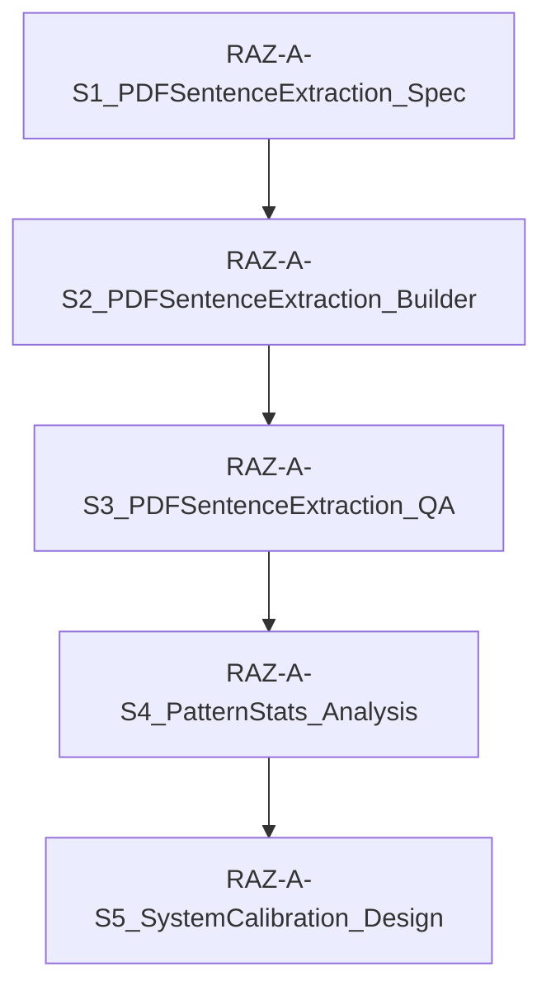

# RAZ-A-S1_PDFSentenceExtraction_Spec

## 1. Purpose

This specification defines a future PDF-to-Excel sentence-level extraction workflow for Reading A-Z (RAZ) Level A books. 

The primary objective is to build a high-quality reference dataset from RAZ Level A publications to support:
- **Sentence length calibration**: Analyzing the word and character counts of early reading materials.
- **Early reader sentence structure analysis**: Understanding grammar patterns and syntax complexity suitable for beginners.
- **Repetition pattern analysis**: Examining how sentences are repeated or slightly altered across pages or books to reinforce learning.
- **Page-level sentence density analysis**: Measuring the number of sentences and words displayed per page.
- **External benchmark comparison**: Evaluating and benchmarking the project's own Sentence Authority and Reading Authority against established external reading corpora.

**CRITICAL POLICY**: This workflow is **NOT** a content import pipeline. Extracted sentences are strictly for reference and comparison purposes. They must not be imported into the production systems as official, reusable teaching or learning content.

---

## 2. Scope

### In Scope
- **Input PDF manifest definition**: Specifying metadata and file locations for the source PDF books.
- **PDF page text extraction rules**: Defining how raw text is read from PDF documents programmatically.
- **Page-level raw text preservation**: Keeping a record of the original, uncleaned text extracted from each page.
- **Sentence splitting rules**: Splitting page text into sentences based on punctuation and layout rules for Level A books.
- **Sentence ID naming convention**: Implementing structured, unique identifiers for pages and sentences.
- **Minimal Excel workbook schema**: Outlining the sheet structure and column definitions for the final export.
- **Extraction status flags**: Programmatic indicators for tracking extraction success and failures.
- **QA review flags**: Flags highlighting items that require human checking or validation.
- **Extraction report requirements**: Summary metrics for verification of batch processing runs.

### Out of Scope
- **OCR implementation**: Image-only PDFs will not be OCR-processed in this phase (marked for review/future work).
- **Audio alignment**: Aligning sentence text with spoken audio files.
- **Grammar tagging**: Part-of-speech (POS) tagging or syntactic parsing.
- **CEFR classification**: Automatic classification of sentences against the Common European Framework of Reference for Languages.
- **ULGA mapping**: Mapping sentences to the Universal Learning Graph Authority nodes.
- **Theme classification**: Categorizing books or sentences by topics or themes.
- **Vocabulary authority matching**: Checking words against vocabulary lists or spelling databases.
- **Direct content reuse**: Utilizing extracted text in commercial worksheets, interactive games, or student-facing products.
- **Commercial worksheet generation**: Generating printable layout pages or exercises.
- **Importing sentences**: Directly saving RAZ sentence rows into the project's primary Sentence Authority database.

---

## 3. Source Role Policy

All extracted data must comply with the following source classification:

```text
source_corpus = RAZ
source_role = external_reference_only
copyright_flag = reference_only
direct_use_allowed = false
```

### Usage Constraints
Extracted sentences are stored purely for analytical benchmarking and statistical calibration. They must **never** be copied or written into the following internal databases:
* Sentence Authority
* Reading Authority
* Dialogue Authority
* Worksheet Authority
* Assessment Authority

---

## 4. Recommended Folder Structure

The planned implementation must operate within the following directory layout:

```text
RAZ_A_Reference_Corpus/
│
├─ input/
│   ├─ pdf/
│   │   ├─ RAZ_A_001.pdf
│   │   ├─ RAZ_A_002.pdf
│   │   └─ ...
│   │
│   └─ manifest/
│       └─ raz_a_books_manifest.xlsx
│
├─ output/
│   ├─ excel/
│   │   └─ raz_a_reference_sentences.xlsx
│   │
│   ├─ json/
│   │   ├─ pages_raw.json
│   │   ├─ sentences_v01.json
│   │   └─ extraction_report.json
│   │
│   └─ logs/
│       └─ extraction_log.txt
│
└─ config/
    └─ raz_a_extraction_config.json
```

---

## 5. Input Manifest Schema

- **File Path**: `input/manifest/raz_a_books_manifest.xlsx`
- **Sheet Name**: `books_manifest`

This manifest catalogs the input files and provides necessary metadata.

### Required Columns
| Column Name | Data Type | Description |
|---|---|---|
| `book_id` | String | Unique book identifier (e.g., `RAZ_A_001`). Primary key. |
| `raz_level` | String | Reading level of the book (always `A` for this batch). |
| `book_no` | Integer | Sequenced index number of the book within Level A. |
| `book_title` | String | Title of the book. |
| `pdf_file` | String | Filename of the target PDF file (e.g., `RAZ_A_001.pdf`). |
| `audio_file` | String | Filename of the corresponding audio file (optional reference). |
| `source_note` | String | Note containing copyright and usage conditions (e.g., `reference_only`). |

#### Example Row
```text
RAZ_A_001 | A | 1 | My Dog | RAZ_A_001.pdf | RAZ_A_001.mp3 | reference_only
```

---

## 6. PDF Text Extraction Rules

When extracting text from the source PDF files, the builder tool must follow this execution order:

1. **Extract via PDF Text Layer**: Attempt to extract text from the PDF using standard Python libraries (such as `pypdf` or `pdfplumber`).
2. **Short Text Detection**: If the total extracted text length across the entire PDF is below the threshold, mark the book as requiring OCR.
3. **No OCR Execution**: Do not implement or run OCR algorithms in the initial version (S1/S2 v0.1).
4. **No Audio Transcription**: Do not process the audio files or perform speech-to-text.

### Detection Thresholds
* **Book-level check**:
  ```text
  If valid extracted characters per PDF < 100:
      extraction_status = image_pdf_needs_ocr
  ```
* **Page-level check**:
  ```text
  If valid extracted characters per page < 5:
      page_text_status = empty_or_image
  ```
  Standardized values for `page_text_status` are:
  - `valid_text`: Page contains sufficient valid extracted text.
  - `empty_or_image`: Page is empty or contains fewer than 5 characters.
  - `needs_review`: Extracted text is suspicious or layout suggests potential issues.
  - `extraction_error`: A technical error occurred during the extraction of this page.

---

## 7. Page-Level Raw Text Preservation

All extracted text must first be saved on a page-by-page level to capture the layout and contents before splitting or cleaning.

### Required Fields
| Field Name | Type | Description |
|---|---|---|
| `page_id` | String | Unique identifier: `{book_id}_P{page_no:03d}` (e.g., `RAZ_A_001_P003`). |
| `book_id` | String | Foreign key to the manifest. |
| `raz_level` | String | The level code (e.g., `A`). |
| `book_title` | String | Title of the book for easy validation. |
| `pdf_file` | String | Name of the processed PDF file. |
| `page_no` | Integer | 1-based page index in the PDF file. |
| `raw_page_text` | String | Unmodified extracted text, including original newlines and spaces. |
| `clean_page_text` | String | Cleaned text after applying basic cleaning rules. |
| `text_source` | String | Source of text extraction (values: `pdf_text_layer`, `ocr`, `manual`). |
| `extractor` | String | Specific tool or library used (values: `pdfplumber_v0.1`, `pypdf_v0.1`, `manual`). |
| `page_text_status` | String | Quality flag (values: `valid_text`, `empty_or_image`, `needs_review`, `extraction_error`). |
| `extraction_confidence` | Float | Confidence score between 0.0 and 1.0 (defaults to 1.0 if text layer is clean). |
| `needs_manual_review` | Boolean | True if the text layer is suspected to be faulty. |
| `notes` | String | Free-text field for developer notes or error messages. |

---

## 8. Page Cleaning Rules

Due to the minimal nature of RAZ Level A books (often containing only one short sentence or phrase per page), cleaning must be extremely conservative. Aggressive cleaning risks deleting actual sentence content.

### Allowed Automatic Cleaning
- Trim leading and trailing whitespace from the page content.
- Normalize repeated spaces into a single space (e.g., replace multiple spaces with one).
- Remove entirely blank lines.
- Remove pure numeric lines that represent page numbers (e.g., a line containing only `"3"` or `"03"`).

### Forbidden Cleaning Operations (DO NOT REMOVE)
- Book titles or author names printed on internal pages.
- Running headers or footers.
- Captions or labels.
- Short or repeated lines (e.g., `"He runs."` repeated across multiple pages).

---

## 9. Sentence Splitting Rules

For version v0.1, a straightforward rules-based approach must be used for sentence splitting.

### Rules
- **Split Punctuation**: Split sentences ONLY on the following terminal punctuation marks:
  - Period (`.`)
  - Question mark (`?`)
  - Exclamation mark (`!`)
- **Punctuation Retention**: Retain the terminal punctuation at the end of the split sentence.
- **Spacing**: Trim leading and trailing spaces from the resulting sentences.
- **Empty Filtering**: Discard any resulting empty strings.
- **Newline Handling**: Replace literal newlines (`\n` or `\r\n`) with a single space. Do **NOT** treat newlines as sentence boundaries unless they are accompanied by sentence-ending punctuation.
- **Commas**: Do **NOT** split sentences on commas (`,`).

### Examples
* **Example 1 (Multiple sentences on a single line)**:
  - *Input*: `I see a dog. I see a cat.`
  - *Outputs*:
    1. `I see a dog.`
    2. `I see a cat.`
* **Example 2 (Sentence wrapped across lines)**:
  - *Input*: `I see\na dog.`
  - *Output*: `I see a dog.`

---

## 10. Sentence Validity Flags

Each extracted sentence must be analyzed and assigned a validity status flag under `sentence_boundary_status` to identify formatting anomalies or extraction errors.

### Status Values
- `clean`: Sentence appears structurally sound and matches expected patterns.
- `medium_review`: Sentence length is between 9 and 12 words, requiring a moderate check.
- `needs_review`: General flag for sentences requiring manual inspection.
- `non_sentence`: Contains symbols or text that does not constitute a linguistic sentence.
- `too_short`: The sentence is too brief to be valid.
- `too_long`: The sentence length exceeds typical boundaries for Level A.
- `missing_punctuation`: The segment lacks a terminal punctuation mark.

### Length & Punctuation Logic
- **`word_count = 1`**: Set status to `too_short` or `needs_review`.
- **`word_count <= 8`**: Set status to `clean` (highly typical for RAZ Level A).
- **`word_count between 9 and 12`**: Set status to `medium_review` or `clean` (rare but possible).
- **`word_count > 12`**: Set status to `needs_review` / `too_long` (extremely rare for Level A).
- **No terminal punctuation (`.`, `?`, or `!`)**: Set status to `missing_punctuation`.

*Note: These status flags assess extraction quality and format validation. They do not evaluate grammatical correctness or assign educational CEFR levels.*

---

## 11. Sentence Output Schema

- **Sheet Name**: `sentences_v01`

This sheet stores the individual sentence entries extracted from all valid books.

### Required Columns
| Column Name | Type | Description |
|---|---|---|
| `sentence_id` | String | Format: `{book_id}_P{page_no:03d}_S{sentence_order_on_page:03d}` (e.g., `RAZ_A_001_P003_S001`). |
| `book_id` | String | Reference to manifest. |
| `raz_level` | String | RAZ Level (e.g., `A`). |
| `book_title` | String | Book Title. |
| `pdf_file` | String | Source PDF filename. |
| `page_no` | Integer | PDF page number containing the sentence. |
| `sentence_order_in_book` | Integer | 1-based sequential counter of the sentence within the entire book. |
| `sentence_order_on_page` | Integer | 1-based sequential counter of the sentence on this specific page. |
| `raw_text` | String | Exact segment text as extracted, prior to sentence-level cleaning. |
| `clean_text` | String | Text with normalized spaces, trimmed edges, and collapsed newlines. |
| `normalized_text` | String | Lowercase version of `clean_text` (retaining punctuation) for comparison. |
| `word_count` | Integer | Count of words in the sentence (using the tokenization rules). |
| `unique_word_count` | Integer | Number of unique words in the sentence. |
| `char_count` | Integer | Total character count of `clean_text` (including spaces and punctuation). |
| `text_source` | String | Source of text extraction (values: `pdf_text_layer`, `ocr`, `manual`). |
| `extractor` | String | Specific tool or library used (values: `pdfplumber_v0.1`, `pypdf_v0.1`, `manual`). |
| `extraction_confidence` | Float | Confidence rating (0.0 to 1.0). |
| `sentence_boundary_status` | String | Status flag (values: `clean`, `medium_review`, `needs_review`, `non_sentence`, `too_short`, `too_long`, `missing_punctuation`). |
| `punctuation_status` | String | Typology of end punctuation (e.g., `period`, `question`, `exclamation`, `none`). |
| `review_status` | String | Verification state (e.g., `pending_review`, `approved`, `rejected`). |
| `copyright_flag` | String | License marker (always `reference_only`). |
| `notes` | String | Remarks or warning messages generated during processing. |

---

## 12. Text Normalization Rules

The sentence extraction engine must populate three distinct text representations:

1. **`raw_text`**:
   - The literal text segment extracted from the PDF before applying cleanup rules.
2. **`clean_text`**:
   - The whitespace-normalized version of `raw_text`. 
   - All leading/trailing spaces are removed.
   - All internal multiple spaces, tabs, and newlines are replaced by a single space.
3. **`normalized_text`**:
   - A lowercase representation of `clean_text`.
   - Sentence-final punctuation is kept (e.g., `"it is a dog."` remains `"it is a dog."`).
   - Retained to facilitate duplicate checks, vocabulary frequency tracking, and matching.

**No-Go Area for v0.1**:
- Do **not** apply lemmatization or stemming (e.g., do not turn `"dogs"` into `"dog"`).
- Do **not** match words to an external vocabulary database.

---

## 13. Word Count Rules

A simplified tokenization process is required to determine the word metrics:

1. **Split**: Split the `clean_text` by space characters.
2. **Strip Punctuation**: Strip trailing punctuation (like `.`, `?`, `!`, `,`) from each split token.
3. **Contractions**: Keep contractions intact as single tokens. Do not split them.

### Example
- *Sentence*: `"I can't see it."`
- *Tokenization process*:
  - Split: `["I", "can't", "see", "it."]`
  - Strip punctuation: `["I", "can't", "see", "it"]`
- *Word Count*: `4` (words: `I`, `can't`, `see`, `it`)

---

## 14. Excel Workbook Output

The output file generated by the future builder must be saved to:
`output/excel/raz_a_reference_sentences.xlsx`

The workbook must contain the following sheets:

| Sheet Name | Description |
|---|---|
| `README` | Introductory sheet with schema version, run date, and copyright constraints. |
| `books` | A copy of the book metadata manifest processed in this run. |
| `pages_raw` | Page-level raw text and metadata. |
| `sentences_v01` | Final clean extracted sentences with analytical features. |
| `sentence_qc` | Sentences flagged as `needs_review` or other non-clean status for QA inspection. |
| `book_summary` | Aggregate statistics calculated for each book. |
| `extraction_report` | Global run metrics for the entire batch. |
| `decision_rules` | A summary reference sheet containing the parameters, rules, and thresholds used. |

---

## 15. Book Summary Schema

- **Sheet Name**: `book_summary`

This sheet aggregate statistics and statuses grouped by book.

### Required Fields
| Field Name | Type | Description |
|---|---|---|
| `book_id` | String | Book identifier. |
| `book_title` | String | Title of the book. |
| `raz_level` | String | RAZ Reading Level (e.g., `A`). |
| `sentence_count` | Integer | Total number of sentences extracted for this book. |
| `word_count_total` | Integer | Sum of all words in the extracted sentences. |
| `avg_sentence_length` | Float | Average words per sentence. |
| `min_sentence_length` | Integer | Minimum words in a sentence. |
| `max_sentence_length` | Integer | Maximum words in a sentence. |
| `unique_word_count` | Integer | Count of unique words used in the entire book. |
| `page_count` | Integer | Total pages found in the PDF. |
| `valid_page_count` | Integer | Number of pages containing text. |
| `needs_review_sentence_count` | Integer | Number of sentences flagged for review in this book. |
| `extraction_status` | String | Extraction status (see below). |
| `qa_status` | String | Quality assurance verification state (e.g., `pending`, `passed`, `failed`). |

### Extraction Status Values
- `done`: Text successfully extracted and processed for all readable pages.
- `partial`: Partially processed; some pages were unreadable or skipped.
- `needs_review`: Processed, but a high percentage of sentences triggered quality flags.
- `image_pdf_needs_ocr`: Text extraction failed due to zero/low character counts (requires OCR).
- `failed`: Extraction process crashed or failed completely for this book.

---

## 16. Extraction Report Schema

- **Sheet Name**: `extraction_report` (and exported as `output/json/extraction_report.json`)

This sheet contains high-level summary metadata for the execution run.

### Required Fields
- `run_id`: Unique string identifying the execution run (e.g., timestamps: `RUN_20260619_2349`).
- `created_at`: Datetime string of the execution run.
- `input_pdf_count`: Number of PDF files listed in the input manifest.
- `processed_pdf_count`: Number of PDFs successfully read.
- `failed_pdf_count`: Number of PDFs that failed to process.
- `total_books`: Total books successfully cataloged.
- `total_pages`: Total pages across all processed PDFs.
- `total_sentences`: Total sentences extracted.
- `avg_sentences_per_book`: Average sentences per book.
- `avg_words_per_sentence`: Average sentence length across the batch.
- `image_pdf_count`: Number of PDFs flagged as `image_pdf_needs_ocr`.
- `needs_review_sentence_count`: Number of sentences flagged with validation errors.
- `output_excel`: File path of the generated Excel workbook.
- `status`: Overall batch execution status (e.g., `completed`, `completed_with_warnings`, `failed`).

---

## 17. QA Sampling Rules

To ensure high-quality extraction without requiring a 100% manual review of every single sentence, the following sampling rules are recommended:

- **Review Boundaries**: For each processed book, a human editor should visually inspect:
  - The first content page.
  - One page in the middle of the book.
  - The final content page.
- **Flagged Sentences**: 100% of sentences marked as `needs_review`, `too_short`, `too_long`, or `missing_punctuation` must be manually reviewed.
- **Low-Quality Triggers**: If a book's `needs_review_sentence_count` exceeds 25% of its total sentence count, the entire book must be flagged for complete manual audit.

---

## 18. Explicit Non-Goals

The future design and construction phases (S1 & S2) explicitly exclude the following tasks:
- Writing or integrating Optical Character Recognition (OCR) engines (e.g. Tesseract, Cloud Vision).
- Building audio-to-text transcription engines or pipelines.
- Developing speech-to-text word/sentence alignments.
- Building grammatical tagging, lemmatization, or POS annotation routines.
- Performing automatic theme or topic categorization.
- Classifying texts against standard language frameworks (such as CEFR levels).
- Mapping sentence structures onto ULGA (Universal Learning Graph Authority) nodes.
- Writing code to import RAZ sentences into the primary system databases (Sentence/Reading Authority).
- Implementing tools for commercial content reuse or generation.
- Generating worksheets, exercises, or student dashboard cards.

---

## 19. Future Phases

The RAZ Level A Reference Corpus project is structured in sequential phases:



- **`RAZ-A-S1_PDFSentenceExtraction_Spec`** (Current):
  - Establish specifications, output structures, and data policies.
- **`RAZ-A-S2_PDFSentenceExtraction_Builder`**:
  - Python tool implementation to parse the manifest, extract page text, split sentences, compute statistics, and write Excel workbooks.
- **`RAZ-A-S3_PDFSentenceExtraction_QA`**:
  - Validating the generated Excel data, reviewing flagged records, and performing QA audits.
- **`RAZ-A-S4_PatternStats_Analysis`**:
  - Analyzing sentence statistics (lengths, repetitions, syntax patterns, distribution) across books.
- **`RAZ-A-S5_SystemCalibration_Design`**:
  - Benchmarking internal authorities against the extracted RAZ Level A pattern data.

---

## 20. Acceptance Criteria

This specification document is considered complete and accepted when:
- [x] The file `docs/raz/RAZ_A_S1_PDF_SENTENCE_EXTRACTION_SPEC.md` exists and is formatted correctly.
- [x] The document clearly outlines the Source Role Policy and copyright limits (`external_reference_only`).
- [x] The schema for `input/manifest/raz_a_books_manifest.xlsx` is defined.
- [x] Rules for PDF text extraction, character thresholds, and OCR flags are defined.
- [x] The schema and ID format for `pages_raw` are defined.
- [x] Basic cleaning rules (and forbidden cleaning operations) are defined.
- [x] Sentence splitting rules for punctuation, newlines, and commas are defined.
- [x] The schemas for the sentence output, book summary, and extraction report are defined.
- [x] The expected sheets for the final Excel workbook output are identified.
- [x] QA rules and sampling ratios are defined.
- [x] Non-goals and future phases are clearly outlined.
- [x] No Python script files, PDF processors, or OCR programs are implemented.
- [x] No real PDF processing or Excel output files are generated.
