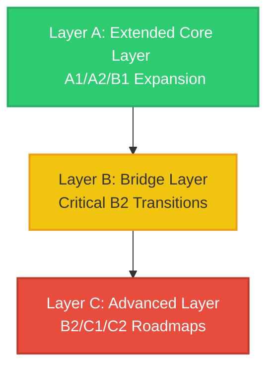

# ULGA-S4D Extended Grammar Dependency Authority Design Scan

## 1. Executive Summary
This document outlines the architecture plan and expansion blueprint for the **Extended Grammar Dependency Authority**. Following the completion of the Core Dependency Layer (ULGA-S4B) and its QA audit (ULGA-S4C), the system holds 1,222 grammar nodes, 183 edges, and 1,070 isolated nodes. 

This design scan establishes a blueprint for connecting the remaining isolated nodes by categorizing them into:
1. **Extended Core Layer (Layer A)**: Enhancing A1–B1 coverage.
2. **Bridge Layer (Layer B)**: Building transition links to critical B2 grammar.
3. **Advanced Layer (Layer C)**: Mapping B2–C2 roadmaps for future implementation.

---

## 2. Isolated Node Analysis
An audit of the 1,070 isolated nodes has been performed on the core graph database. The exact metrics and distributions are detailed below:

### 2.1 Basic Counts
- **Total Nodes**: 1,222
- **Connected Nodes**: 152
- **Isolated Nodes**: 1,070 (87.56%)

### 2.2 CEFR Level Distribution of Isolated Nodes
- **A1**: 59 nodes
- **A2**: 228 nodes
- **B1**: 301 nodes
- **B2**: 241 nodes
- **C1**: 129 nodes
- **C2**: 112 nodes

### 2.3 Family Distribution of Isolated Nodes
- **MODALITY**: 225 nodes
- **CLAUSES**: 124 nodes
- **PRONOUNS**: 103 nodes
- **PAST**: 75 nodes
- **ADJECTIVES**: 70 nodes
- **ADVERBS**: 68 nodes
- **FUTURE**: 58 nodes
- **NOUNS**: 54 nodes
- **VERBS**: 52 nodes
- **DETERMINERS**: 51 nodes
- **PASSIVES**: 40 nodes
- **NEGATION**: 30 nodes
- **QUESTIONS**: 25 nodes
- **CONJUNCTIONS**: 22 nodes
- **PRESENT**: 17 nodes
- **REPORTED SPEECH**: 17 nodes
- **FOCUS**: 15 nodes
- **PREPOSITIONS**: 13 nodes
- **DISCOURSE MARKERS**: 11 nodes

### 2.4 Top Subtype Distribution of Isolated Nodes
1. **PASSIVES/passives: form**: 33 nodes
2. **NEGATION/negation**: 30 nodes
3. **ADVERBS/adverbs and adverb phrases: types and meanings**: 30 nodes
4. **NOUNS/noun phrases**: 29 nodes
5. **CLAUSES/conditional**: 27 nodes
6. **MODALITY/would**: 23 nodes
7. **MODALITY/expressions with be**: 23 nodes
8. **ADJECTIVES/superlatives**: 20 nodes
9. **MODALITY/must**: 20 nodes
10. **CLAUSES/relative**: 19 nodes

---

## 3. Family Expansion Model
To systematically cover the isolated nodes, we classify the entire database into 16 core grammar families and score them on a scale of 1–5 for implementation priority.

| Family Name | Node Count | Connected | Isolated | Dependency Readiness | Confidence Level | Implementation Difficulty | Priority Score |
| :--- | :---: | :---: | :---: | :---: | :---: | :---: | :---: |
| **A. Question Family** | 35 | 10 | 25 | `PARTIAL` | 5 (Very High) | 1 (Very Low) | **5** |
| **B. Tense Family** | 197 | 57 | 140 | `PARTIAL` | 5 (Very High) | 2 (Low) | **5** |
| **C. Modal Family** | 239 | 14 | 225 | `PARTIAL` | 4 (High) | 3 (Medium) | **4** |
| **D. Pronoun Family** | 119 | 16 | 103 | `PARTIAL` | 5 (Very High) | 1 (Very Low) | **5** |
| **E. Determiner Family** | 70 | 19 | 51 | `PARTIAL` | 5 (Very High) | 1 (Very Low) | **5** |
| **F. Noun Phrase Family** | 56 | 2 | 54 | `PARTIAL` | 4 (High) | 2 (Low) | **4** |
| **G. Adjective Family** | 107 | 5 | 102 | `PARTIAL` | 4 (High) | 2 (Low) | **4** |
| **H. Comparison Family** | 61 | 9 | 52 | `PARTIAL` | 4 (High) | 2 (Low) | **4** |
| **I. Preposition Family** | 15 | 2 | 13 | `PARTIAL` | 4 (High) | 2 (Low) | **4** |
| **J. Connector Family** | 37 | 4 | 33 | `PARTIAL` | 4 (High) | 3 (Medium) | **4** |
| **K. Clause Family** | 115 | 8 | 107 | `PARTIAL` | 3 (Medium) | 4 (High) | **3** |
| **L. Relative Clause Family**| 19 | 0 | 19 | `NOT READY` | 4 (High) | 3 (Medium) | **3** |
| **M. Passive Family** | 40 | 0 | 40 | `NOT READY` | 4 (High) | 3 (Medium) | **3** |
| **N. Perfect Aspect Family** | 68 | 6 | 62 | `PARTIAL` | 4 (High) | 3 (Medium) | **4** |
| **O. Conditional Family** | 27 | 0 | 27 | `NOT READY` | 4 (High) | 3 (Medium) | **3** |
| **P. Reported Speech Family**| 17 | 0 | 17 | `NOT READY` | 4 (High) | 3 (Medium) | **3** |

---

## 4. Three-Layer Model Design

### 4.1 Layer A: Extended Core Layer
- **CEFR Scope**: A1, A2, B1
- **Focus**: Expanding core syntax nodes (adverbs of manner, simple relative clauses in B1, present perfect simple transitions, basic modal can/could/must variants).
- **Target Metrics**: 
  - Projected Rules: 200–250 rules
  - Projected Edges: 300–400 edges

### 4.2 Layer B: Bridge Layer
- **CEFR Scope**: Critical B2 transition hubs
- **Focus**: Connecting core grammar to essential intermediate-advanced structures necessary for secondary-school vocabulary and sentence pattern mounting.
  - *Passive voice* basic forms.
  - *Defining relative clauses* with prepositions.
  - *Past perfect simple* for temporal narrative ordering.
  - *Reported speech* basic reporting verb patterns.
- **Target Metrics**:
  - Projected Rules: 80–100 rules
  - Projected Edges: 120–150 edges

### 4.3 Layer C: Advanced Layer
- **CEFR Scope**: B2, C1, C2 advanced syntax
- **Focus**: Deferred from implementation. Only structured roadmaps will be built to define transitions to:
  - *Inversion* (e.g., negative inversion).
  - *Cleft sentences* (It-clefts, Wh-clefts).
  - *Nominalisation* (turning verbs/adjectives into nouns for formal registers).
  - *Subjunctive mood* forms.
  - *Complex hedging* expressions.

---

## 5. Dependency Tier Model
We define five confidence tiers for the expanded dependency rules:

1. **Tier 1: Very High Confidence (Syntactic Foundations)**: Morphological inflections and basic word order (e.g., base verbs -> present simple).
2. **Tier 2: High Confidence (Syntactic Extensions)**: Transformations of affirmative structures to negative and interrogative forms within the same CEFR level.
3. **Tier 3: Medium Confidence (Semantic Progressions)**: Cross-conceptual mappings representing usage expansion (e.g., state verbs -> present perfect).
4. **Tier 4: Review / Spiral (Pedagogical Scaffolding)**: Review loops connecting related concepts across levels (e.g., simple past -> present perfect simple).
5. **Tier 5: Advanced Expert Layer (Stylistic Syntactic Alternations)**: Stylistic choices and emphasis constructs (e.g., active -> passive, standard statement -> cleft/inversion).

---

## 6. Coverage Projection

| Phase | Connected Nodes | Isolated Nodes | Edge Count |
| :--- | :---: | :---: | :---: |
| **Current (Core Layer)** | 152 | 1,070 | 183 |
| **Phase E1: Extended Core** | 450–550 | 672–772 | 500–600 |
| **Phase E2: Bridge Layer** | 600–700 | 522–622 | 650–750 |
| **Phase E3: Advanced Layer (Future)** | 1,100–1,222 | 0–122 | 1,200–1,500 |

---

## 7. Authority Readiness Assessment
This section assesses the readiness of our current Grammar Dependency Layer to support dependent systems:

- **Vocabulary Authority**: `PARTIAL` (Core parts of speech are mapped, but vocabulary requires more granular noun phrase and adjective/adverb dependencies to anchor word-family associations).
- **Chunk Authority**: `PARTIAL` (Chunk syntax maps heavily to tense, modals, and conditional structures which are currently isolated).
- **Theme Spiral**: `READY` (Lexical thematic groupings are independent of fine-grained grammar syntax and can use the current scaffolding immediately).
- **Sentence Pattern Authority**: `PARTIAL` (Sentence patterns require relative clause, passive voice, and conditional structures to be connected).
- **Antigravity Planner**: `PARTIAL` (The current 183 edges can support basic pathways but will run into planning bottlenecks due to the high isolated node ratio).

---

## 8. Roadmap Recommendation
We compare three execution pathways for moving forward:

- **Option A**: Proceed directly to Vocabulary Mounting.
- **Option B**: Complete the Extended Core Layer before starting Vocabulary.
- **Option C (Recommended)**: **Complete the Bridge Layer (Layer B), then mount Vocabulary in parallel.**
  - *Rationale*: Mounting vocabulary requires a mature grammar dependency skeleton that includes relative clauses (for definition mapping) and basic passives/perfect aspects. Option C establishes these critical transition hubs (Bridge Layer) first, enabling a robust vocabulary mounting phase while maintaining optimal project velocity.

---

## 9. Priority Mapping Answers
To structure Layer B and Layer C, we identify which intermediate-advanced families must be prioritized:

### 9.1 Families Moved Early to Bridge Layer (Layer B)
- **M. Passive Family** (Basic form, required for passive-heavy lexical items).
- **L. Relative Clause Family** (Defining relative clauses, required for dictionary-style vocabulary definitions).
- **N. Perfect Aspect Family** (Present perfect simple/continuous, key to verb aspect progressions).
- **O. Conditional Family** (First/second conditionals, necessary to map conditional expressions in lexical chunks).
- **P. Reported Speech Family** (Basic reported statements, required to anchor dialogue/narrative expressions).

### 9.2 Families Delayed to Advanced Layer (Layer C)
- **K. Clause Family (Focus / Clefts / Inversion)** (Cleft sentences and negative inversion are stylistic and can be delayed).
- **C. Modal Family (Speculation & Complex Hedging)** (C1/C2 modal syntax represents hedging in academic registers and can be delayed).
- **J. Connector Family (Discourse Markers)** (Complex cohesive devices belong to advanced writing registers and are not needed for core vocabulary mounting).

---

## 10. Forbidden Actions Check
- Modified `grammar_profile.json`? **No**
- Modified `grammar_nodes.json`? **No**
- Modified `grammar_dependency_core_rules.json`? **No**
- Modified `grammar_dependency_core_edges.json`? **No**
- Added graph nodes? **No**
- Added graph edges? **No**
- Modified vocabulary/chunk/theme? **No**
- Modified runtime? **No**
- Created `learner_state`? **No**
- Created recommendation? **No**
- Created planner? **No**

---

## 11. Final Verdict
**Final Verdict**: **PASS** (Architecture plan completed, isolated node distribution audit finished, and Layer A/B/C roadmaps fully defined with zero forbidden actions).
