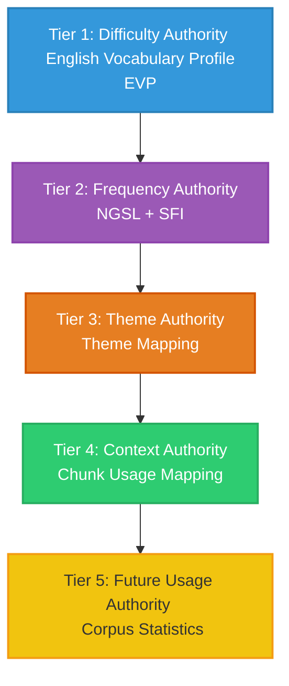

# ULGA-S5A Vocabulary Authority Design Scan Report

This report presents the architectural scan and graph schema design for the **Vocabulary Authority Layer** in the Universal Learning Graph Architecture (ULGA).



---

## 1. Vocabulary Authority Hierarchy
The Vocabulary Authority resolves lexical items into a unified learning progression by stacking five distinct authority sources:

1. **Tier 1: Difficulty Authority (EVP)**
   - **Role**: Primary arbiter of CEFR levels, lexical bounds, and meaning disambiguation (guidewords).
   - **Rationale**: EVP prevents vocabulary from being sorted purely by raw frequency, protecting logical pedagogical leveling.
2. **Tier 2: Frequency Authority (NGSL + SFI)**
   - **Role**: Establishes numerical priority rank and Standard Frequency Index (SFI).
   - **Rationale**: Acts as a safety net on EVP leveling anomalies, ensuring high-frequency words are prioritized regardless of nominal CEFR tags.
3. **Tier 3: Theme Authority (Theme Mapping)**
   - **Role**: Groups vocabulary into thematic clusters (e.g., *Travel*, *Food*).
   - **Rationale**: Enables topic-based lexical acquisition and spiraled topic planning.
4. **Tier 4: Context Authority (Chunk Usage)**
   - **Role**: Identifies collocations and phraseological contexts.
   - **Rationale**: Words are never taught in isolation; chunk mapping binds lemmas to their natural syntactic realizations.
5. **Tier 5: Usage Authority (Corpus Statistics)**
   - **Role**: Adapts rankings based on target learner demographics or modern language corpora.
   - **Rationale**: Keeps the dictionary adaptive to changing web, chat, or academic registers.

---

## 2. Vocabulary Node Schema Design
A mounted Vocabulary Node in the ULGA graph must conform to the following schema structure:

```json
{
  "id": "vocabulary:VOCAB_NODE_00001",
  "node_type": "vocabulary",
  "label": "cattle",
  "authority_source": {
    "source_name": "English Vocabulary Profile Online / NGSL",
    "source_file": "vocabulary/json/vocabulary.json",
    "source_record_id": "v_2",
    "derivation": "derived_safe_layer"
  },
  "cefr_level": "B1",
  "confidence": {
    "value": 0.90,
    "method": "rule_based"
  },
  "version": {
    "contract": "ULGA-S2",
    "source_version": "1.0.0",
    "generated_at": "2026-06-15T03:25:20Z"
  },
  "metadata": {
    "canonical_lemma": "cattle",
    "frequency_rank": 4150,
    "frequency_score": 52.72,
    "theme_tags": ["animals"],
    "chunk_count": 0,
    "part_of_speech": "noun",
    "lexical_type": "word",
    "mounting_stage": "ULGA-S5B",
    "grammar_prerequisites": []
  }
}
```

---

## 3. Vocabulary Dependency Analysis
Vocabulary acquisition is associative, associative networks of semantics are better modeled via metadata tags and specific non-prerequisite edges rather than strict linear pathways.

- **A. Hard Dependency**: Extremely rare. Restricted to numeric progressions (e.g. *one* -> *ten* -> *hundred*) or absolute structural dependencies.
- **B. Soft Dependency**: Hypernym-to-hyponym semantic scaffolding (e.g. *color* -> *red*, *animal* -> *dog*).
- **C. Theme Dependency**: Topic co-occurrence. These should be represented by `belongs_to` edges to theme catalog nodes, rather than sequential prerequisites.
- **D. Morphology Dependency**: Derivational hierarchies (word families). Modelled as hierarchy parent-child edges (`derived_from`).
- **E. Chunk Dependency**: Structural connections from collocations back to their target lemma anchors (e.g. *bus stop* -> *bus*).

---

## 4. Morphology Graph Layer
The **Morphology Layer** constitutes a critical vertical axis in the vocabulary graph:

```
play (Base Lemma)
  ├── player (Noun: Agent)
  ├── playing (Gerund/Participle)
  ├── played (Past Tense form)
  └── playful (Adjective)
```

> [!TIP]
> Morphology should be a distinct, formal sub-layer. Linking derived words back to their base lemma allows the Antigravity Planner to treat a **Word Family** as a single cognitive unit. If the base form and morphological grammar rules are mastered, the derived words can be unlocked dynamically.

---

## 5. Vocabulary & Grammar Integration
Vocabulary units often depend on grammatical structures:
- Quantifiers like *much*, *many*, *few*, *little* require an understanding of countable vs uncountable nouns.
- Comparatives like *worse*, *better* require comparative syntax.

> [!IMPORTANT]
> To preserve node-type boundaries, we **prohibit** direct graph edges between Vocabulary Nodes and Grammar Nodes. Instead, grammar requirements must be listed as metadata links (`grammar_prerequisites = ["grammar:GRAMMAR_NODE_000793"]`) inside the Vocabulary Node.

---

## 6. Vocabulary & Chunk Integration
Chunks and vocabulary share a parent-child relationship:
- **Lemma Anchor (Vocabulary)**: The lemma (e.g. *bus*) is the primary structural anchor.
- **Phraseological Context (Chunk)**: The chunk (e.g. *miss the bus*) is the situational context.

The chunk represents a collocation that **uses** the vocabulary word. The edge must be defined as:
`chunk:CHUNK_001` ─── `uses` ───> `vocabulary:VOCAB_001`
Thus, chunks depend on vocabulary anchors, while vocabulary anchors are independent.

---

## 7. Vocabulary & Theme Integration
Themes represent semantic sets. Vocabulary nodes should not connect to each other via theme edges. Instead:
- Small datasets: Store them as metadata tags (`theme_tags = ["travel"]`).
- Large datasets: Connect vocabulary nodes to dedicated **Theme Catalog Nodes** via `belongs_to` edges (e.g., `vocab_node -> belongs_to -> theme_node`).

---

## 8. Vocabulary Graph Layer Architecture
We organize the Vocabulary Graph into 5 distinct sub-layers:

- **Layer A: Core Vocabulary**: High-frequency lemmas covering A1–B1.
- **Layer B: Theme Vocabulary**: Focused situational vocab (Travel, School, Home, Food).
- **Layer C: Morphology Layer**: Word family hierarchies mapping derivations to base lemmas.
- **Layer D: Chunk Reference Layer**: Links connecting collocational chunks to lemmas.
- **Layer E: Advanced Vocabulary**: B2+ low-frequency academic and register-specific vocabulary.

---

## 9. Roadmap Projection
- **S5B: Vocabulary Node Mounting**: Parsing `vocabulary.json` and mounting raw lemmas as nodes.
- **S5C: Vocabulary Core Layer**: Building core A1–B1 dependencies.
- **S5D: Vocabulary Theme Layer**: Connecting theme catalog nodes to vocabulary nodes.
- **S5E: Vocabulary Morphology Layer**: Linking word family trees.
- **S5F: Vocabulary QA Audit**: Auditing coverage, safety, and path connectivity.

---

## 10. Priority Mapping for B2/C1/C2 Families

### 10.1 Early Bridge Layer Priorities (Tier 2/3 transitions)
- **Relative Clause Verbs/Nouns** (e.g., *contact*, *location*, *relationship* - required to map relative clauses).
- **Passive Voice Verbs** (e.g., *manufacture*, *publish*, *distribute* - required to map passive voice forms).
- **Perfect Aspect Adverbs** (e.g., *recently*, *already*, *since* - required to map present/past perfect simple).

### 10.2 Delayed Advanced Layer Priorities (C1/C2)
- **Hedging Verbs** (e.g., *hypothesize*, *stipulate*, *conjecture*).
- **Advanced Conjunctions** (e.g., *notwithstanding*, *furthermore*, *consequently*).
- **Nominalised abstract concepts** (e.g., *nominalisation*, *implementation*).

---

## 11. Authority Readiness Assessment
- **Chunk Authority**: `READY` (Vocabulary nodes provide lemmas needed to resolve chunk components).
- **Theme Spiral**: `READY` (Vocabulary metadata has themes, allowing direct integration).
- **Sentence Pattern Authority**: `PARTIAL` (Needs vocabulary categorization by detailed Part of Speech to fit pattern slots).
- **Antigravity Planner**: `READY` (Vocabulary levels and ranks are fully specified, allowing path sorting).

---

## 12. Forbidden Actions Check
- Modified `grammar_profile.json`? **No**
- Modified `grammar_nodes.json`? **No**
- Modified `grammar_dependency_core_rules.json`? **No**
- Modified `grammar_dependency_core_edges.json`? **No**
- Added graph nodes or edges? **No**
- Modified vocabulary/chunk/theme? **No**
- Created `learner_state`? **No**
- Created recommendation/planner? **No**
- Modified generator/validator runtime? **No**

---

## 13. Final Verdict
**Final Verdict**: **PASS** (Vocabulary Authority hierarchy, schema metadata, morphology layering, and roadmap projection are fully completed with zero forbidden actions).
