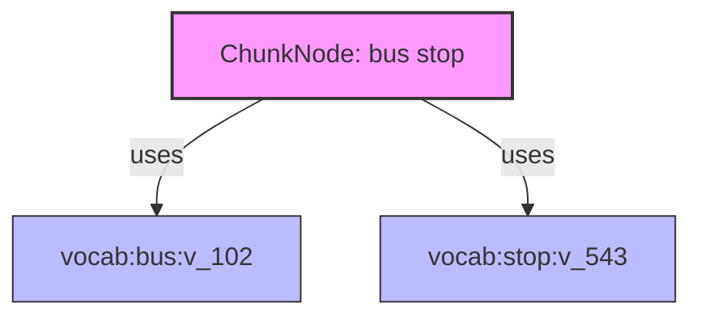
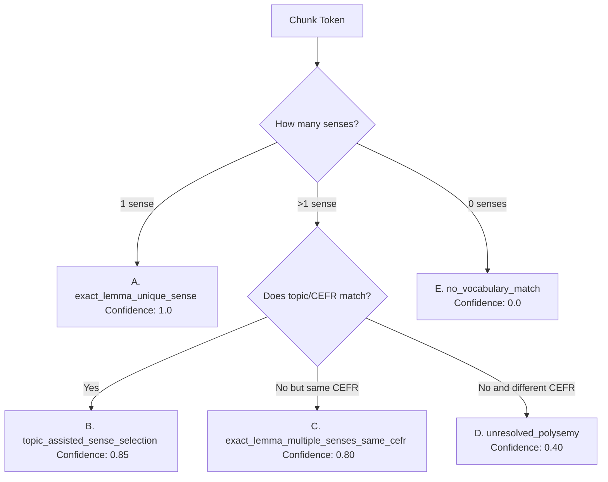
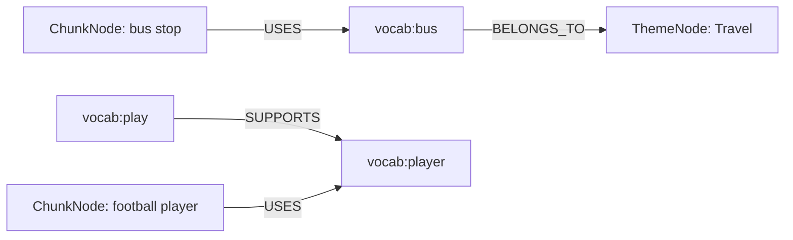
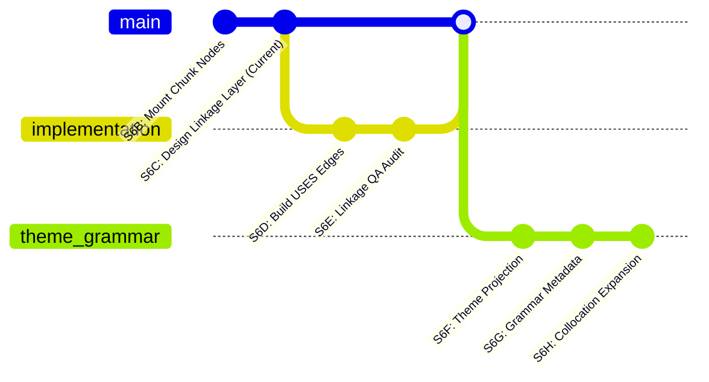

# ULGA-S6C Chunk-Vocabulary Linkage Design Scan

This report defines the architecture and design specifications for the **Chunk-Vocabulary Linkage Layer** under `ULGA-S6C`. It establishes how mounted `ChunkNode` records link to `VocabularyNode` records in the learning graph. 

This task is a **Design Scan** only. No chunk-vocabulary edges have been created, and no database, graph, source, or runtime files have been modified.

---

## 1. Document & Process Trace

### 1.1 Files Created
- [ULGA_S6C_CHUNK_VOCABULARY_LINKAGE_DESIGN_SCAN.md](file:///G:/HomeWork/English_Learning_DB/docs/ulga/ULGA_S6C_CHUNK_VOCABULARY_LINKAGE_DESIGN_SCAN.md) (This file)

### 1.2 Files Modified
- **None** (Strictly prohibited by task rules).

### 1.3 Files Inspected
- **Design & QA Documents**:
  - [ULGA_S6A_CHUNK_AUTHORITY_DESIGN_SCAN.md](file:///G:/HomeWork/English_Learning_DB/docs/ulga/ULGA_S6A_CHUNK_AUTHORITY_DESIGN_SCAN.md)
  - [ULGA_S6B_CHUNK_NODE_MOUNTING_CLOSEOUT.md](file:///G:/HomeWork/English_Learning_DB/docs/ulga/ULGA_S6B_CHUNK_NODE_MOUNTING_CLOSEOUT.md)
  - [ULGA_S5C_VOCABULARY_AUTHORITY_QA_AUDIT.md](file:///G:/HomeWork/English_Learning_DB/docs/ulga/ULGA_S5C_VOCABULARY_AUTHORITY_QA_AUDIT.md)
  - [ULGA_S5G_VOCABULARY_THEME_REFINEMENT_QA_AUDIT.md](file:///G:/HomeWork/English_Learning_DB/docs/ulga/ULGA_S5G_VOCABULARY_THEME_REFINEMENT_QA_AUDIT.md)
  - [ULGA_S5J_VOCABULARY_MORPHOLOGY_LAYER_QA_AUDIT.md](file:///G:/HomeWork/English_Learning_DB/docs/ulga/ULGA_S5J_VOCABULARY_MORPHOLOGY_LAYER_QA_AUDIT.md)
  - [ulga_schema_contract.md](file:///G:/HomeWork/English_Learning_DB/docs/ulga/ulga_schema_contract.md)
  - [ulga_roadmap.md](file:///G:/HomeWork/English_Learning_DB/docs/ulga/ulga_roadmap.md)
- **Graph & Edge Datasets**:
  - [chunk_nodes.json](file:///G:/HomeWork/English_Learning_DB/ulga/graph/chunk_nodes.json)
  - [ulga_graph.chunk_nodes.json](file:///G:/HomeWork/English_Learning_DB/ulga/graph/ulga_graph.chunk_nodes.json)
  - [vocabulary_nodes.json](file:///G:/HomeWork/English_Learning_DB/ulga/graph/vocabulary_nodes.json)
  - [vocabulary_morphology_edges.json](file:///G:/HomeWork/English_Learning_DB/ulga/graph/vocabulary_morphology_edges.json)
  - [vocabulary_theme_edges.refined.json](file:///G:/HomeWork/English_Learning_DB/ulga/graph/vocabulary_theme_edges.refined.json)
  - [grammar_dependency_all_edges.json](file:///G:/HomeWork/English_Learning_DB/ulga/graph/grammar_dependency_all_edges.json)
- **Source Config files**:
  - [chunks.json](file:///G:/HomeWork/English_Learning_DB/chunk_profile/json/chunks.json)
  - [chunks_generator_safe.json](file:///G:/HomeWork/English_Learning_DB/chunk_profile/json/chunks_generator_safe.json)
  - [chunk_equivalence_groups.json](file:///G:/HomeWork/English_Learning_DB/chunk_profile/json/chunk_equivalence_groups.json)
  - [chunk_usage_class_mapping.json](file:///G:/HomeWork/English_Learning_DB/chunk_profile/json/chunk_usage_class_mapping.json)

---

## 2. Chunk-Vocabulary Linkage Assessment

A statistical analysis was executed across the mounted 3,522 `ChunkNode` records and 15,696 `VocabularyNode` records.

### 2.1 Basic Metrics
- **Mounted ChunkNode Count (`chunk_node_count`)**: 3,522
- **Mounted VocabularyNode Count (`vocabulary_node_count`)**: 15,696
- **Unique Tokens in Chunk Surfaces**: 2,158

### 2.2 Chunk Token Length Distribution
We extracted token lists from the `normalized_chunk` of each ChunkNode. The token count distribution is:

| Token Length | Node Count | Ratio |
| :--- | :---: | :---: |
| **1 token** | 45 | 1.28% |
| **2 tokens** | 959 | 27.23% |
| **3 tokens** | 749 | 21.27% |
| **4+ tokens** | 1,769 | 50.23% |
| **Total** | **3,522** | **100.00%** |

> [!NOTE]
> Single-token chunks (45 nodes, 1.28%) represent entries that contain grammar structures or specialized terms stored as single words (e.g. contractions, compound symbols). The bulk of the chunk pool (over 71.5%) consists of 3 or more tokens.

### 2.3 Token Coverage in Vocabulary
We checked how many unique tokens extracted from chunks map directly to at least one vocabulary node (via its canonical lemma):

- **Unique chunk tokens covered by vocabulary**: 1,663 (77.06%)
- **Unique chunk tokens missing in vocabulary**: 495 (22.94%)

On a per-chunk level, the coverage is:
- **Chunks with ALL tokens covered**: 1,630 (46.28%)
- **Chunks with AT LEAST ONE token covered**: 3,511 (99.69%)
- **Chunks with ZERO tokens covered**: 11 (0.31%)

#### The 11 Zero-Coverage Chunks
Inspection reveals why these 11 chunks have absolutely zero vocabulary overlap under exact string matching:
1. `'genetically modified'` (Both components missing as independent lemmas)
2. `'inverted commas'` (Both components missing as independent lemmas)
3. `"sb's/sth's clutches"` (The word `clutches` is inflected. Its base lemma `clutch` is present, but exact string match fails; `sb's`/`sth's` are grammatical placeholders)
4. `"sb's finances"` (The word `finances` is inflected; its base `finance` is present but doesn't match; `sb's` is a placeholder)
5. `'fulfil criteria/requirements/qualifications, etc.'` (The components are inflected/plural forms: `criteria` $\rightarrow$ `criterion`, `requirements` $\rightarrow$ `requirement`, `qualifications` $\rightarrow$ `qualification`, plus the British spelling `fulfil` vs American `fulfill`)
6. `'lay eggs'` (The verb `lay` is missing from vocabulary; the noun `eggs` is plural whereas the vocabulary contains singular `egg`)
7. `"sb's looks"` (`looks` is inflected vs singular `look`)
8. `"it's sb/sth"` (Contains contraction `it's` and placeholders)
9. `'prospective buyers/employers/parents, etc.'` (Contains plurals `buyers`/`employers`/`parents` vs singulars, plus `prospective` and `etc.` which are absent)
10. `"sb's prospects"` (`prospects` is inflected vs `prospect`)
11. `"sb's travels"` (`travels` is inflected vs `travel`)

> [!IMPORTANT]
> This highlights a **Morphology Gap** between chunk surface forms (which contain inflections, plurals, and spelling variations) and vocabulary canonical lemmas. This mandates that the anchoring engine support morphology-aware matching in the implementation stage.

### 2.4 Usage Class Distribution
| usage_class | Count | Ratio |
| :--- | :---: | :---: |
| **general_phrase** | 1,770 | 50.26% |
| **phrasal_verb** | 709 | 20.13% |
| **prepositional_phrase** | 304 | 8.63% |
| **idiom** | 260 | 7.38% |
| **time_phrase** | 180 | 5.11% |
| **compound_noun** | 112 | 3.18% |
| **place_phrase** | 100 | 2.84% |
| **quantity_phrase** | 16 | 0.45% |
| **discourse_marker** | 14 | 0.40% |
| **modal_expression** | 10 | 0.28% |
| **compound_adjective** | 9 | 0.26% |
| **social_expression** | 9 | 0.26% |
| **greeting** | 7 | 0.20% |
| **grammar_term** | 5 | 0.14% |
| **opinion_expression** | 5 | 0.14% |
| **emotion_expression** | 5 | 0.14% |
| **daily_routine** | 4 | 0.11% |
| **request_expression** | 3 | 0.09% |

### 2.5 CEFR Distribution
| CEFR Level | Chunk Count | Ratio |
| :--- | :---: | :---: |
| **A1** | 76 | 2.16% |
| **A2** | 243 | 6.90% |
| **B1** | 566 | 16.07% |
| **B2** | 946 | 26.86% |
| **C1** | 559 | 15.87% |
| **C2** | 1,132 | 32.14% |

> [!WARNING]
> The chunk pool is heavily skewed toward advanced levels (B2 to C2 make up 74.87% of all chunks). The planner and gate engine must ensure that these advanced chunks do not bloat low-level learning paths.

### 2.6 Theme Hint Distribution
The distribution of the native `theme_hint` list in the source metadata is:
- **General**: 3,077 (87.37%)
- **Personal**: 194 (5.51%)
- **Travel**: 78 (2.21%)
- **Hobbies**: 54 (1.53%)
- **Shopping**: 50 (1.42%)
- **Health**: 42 (1.19%)
- **Home**: 24 (0.68%)
- **Food**: 20 (0.57%)
- **School**: 11 (0.31%)
- **DailyRoutine**: 2 (0.06%)

---

## 3. Vocabulary Anchor Strategy

We define six core anchoring modes to connect chunks to vocabulary nodes:



### A. Exact Lemma Anchor
- **Definition**: Direct match of a chunk token to a single vocabulary canonical lemma.
- **Example**: `bus stop` $\rightarrow$ `bus` and `stop`.
- **Handling**: Create a `USES` edge for each matched token.

### B. Multi-token Anchor
- **Definition**: Matching chunks that contain multiple content-carrying words, requiring multiple independent anchor edges.
- **Example**: `ice cream` $\rightarrow$ `ice` and `cream`.
- **Handling**: Establish separate links to both vocabulary sense nodes.

### C. Headword Anchor
- **Definition**: Identifying the syntactic/semantic headword of the chunk to carry the primary POS or grammatical category.
- **Example**: `football player` $\rightarrow$ `player` (Headword Noun), `football` (Modifier Noun).
- **Handling**: Store `metadata.anchor_role = "head"` on the link to the headword, and `"modifier"` on the other.

### D. Function-Word Filtered Anchor
- **Definition**: Ignoring non-semantic functional words (articles, basic prepositions) unless they are key syntactic components.
- **Example**: `a lot of` $\rightarrow$ Anchor only `lot`. The words `a` and `of` are ignored to prevent overlinking.
- **Handling**: Apply a stopword filter. Do not create edges for filtered tokens.

### E. Idiom / Formulaic Anchor
- **Definition**: Non-compositional chunks where the meaning cannot be deduced from individual parts.
- **Example**: `by the way`
- **Handling**: Link only to the most central content words (if any) or mark the edges with `confidence.value < 0.6` and `metadata.anchor_role = "formulaic_component"`. Idioms should rely primarily on phrase-level learning rather than strict lexical composition.

### F. Grammar-like Chunk Anchor
- **Definition**: Chunks that represent lexicalized grammar patterns.
- **Example**: `going to`, `used to`, `have to`, `as soon as`.
- **Handling**: Map tokens to auxiliary verbs/markers, but apply `metadata.is_grammar_anchor = true` and target a specific grammar pattern reference in metadata rather than plain lexical senses.

---

## 4. Edge Design: The `USES` Edge

Edges linking chunks to vocabulary must conform to the ULGA Schema Contract:

### 4.1 Schema Contract
```json
{
  "edge_id": "edge:chunk:bus_stop:uses:vocabulary:bus:v_102",
  "edge_type": "USES",
  "from_node_id": "chunk:bus_stop",
  "to_node_id": "vocabulary:bus:v_102",
  "direction": "from_requires_to",
  "authority_source": {
    "source_name": "ULGA Chunk Vocabulary Linkage",
    "source_file": null,
    "source_record_id": null,
    "derivation": "rule_based"
  },
  "confidence": {
    "value": 0.95,
    "method": "exact_lemma_unique_sense"
  },
  "metadata": {
    "anchor_role": "modifier",
    "token_position": 0,
    "surface_form": "bus"
  },
  "version": {
    "contract": "ULGA-S2",
    "source_version": "1.0.0",
    "generated_at": null
  }
}
```

### 4.2 Candidate `anchor_role` Enums
To capture the precise relationship of the anchor, `metadata.anchor_role` must be populated with one of the following:

- **`head`**: The central semantic and syntactic element of the phrase (e.g. `stop` in `bus stop`).
- **`modifier`**: An element modifying the head (e.g. `bus` in `bus stop`).
- **`object`**: The grammatical object in verb-noun phrases (e.g. `football` in `play football`).
- **`verb_anchor`**: The main verb in verbal chunks (e.g. `take` in `take part`).
- **`noun_anchor`**: The main noun in nominal chunks.
- **`adjective_anchor`**: The main adjective in adjectival chunks (e.g. `happy` in `happy ending`).
- **`function_word`**: Syntactic filler words that are kept for structural integrity.
- **`formulaic_component`**: Elements of opaque idioms or expressions (e.g. `way` in `by the way`).
- **`unresolved`**: Temporary fallback role for low-confidence mappings.

---

## 5. Sense Disambiguation Strategy

`VocabularyNode` records are sense-level (e.g. `vocabulary:play:v_6582` [verb] vs `vocabulary:play:v_6583` [noun]), while chunk tokens are simple surface strings. The anchoring engine must use a **Confidence Hierarchy** to select the correct sense node.

### Confidence Hierarchy



#### A. `exact_lemma_unique_sense` (Confidence: `1.0`)
- **Criteria**: Token matches exactly one vocabulary node (canonical lemma) with only one dictionary sense.
- **Action**: Auto-create edge with high confidence.

#### B. `topic_assisted_sense_selection` (Confidence: `0.85`)
- **Criteria**: Token matches a lemma with multiple senses, but one sense has a `topic` or `theme` metadata tag that matches the chunk's topic/theme hint.
- **Example**: `play` in `play football` is matched to `play (verb, game/sport)` because the chunk is tagged with `Hobbies`/`Sports`.
- **Action**: Auto-select the matching sense.

#### C. `exact_lemma_multiple_senses_same_cefr_or_topic` (Confidence: `0.80`)
- **Criteria**: Token matches a lemma with multiple senses that share the same CEFR level and general category, meaning path gates will not be affected.
- **Action**: Select the most frequent sense.

#### D. `unresolved_polysemy` (Confidence: `0.40`)
- **Criteria**: Token matches a highly polysemous lemma with distinct CEFR levels (e.g. A1 vs C2 senses) and no topic/theme data exists to resolve it.
- **Action**: Create a provisional edge, flag it with `metadata.requires_manual_review = true`, and exclude it from gate calculations.

#### E. `no_vocabulary_match` (Confidence: `0.0`)
- **Criteria**: Token is not in the vocabulary nodes (e.g. due to spelling, proper names, or vocabulary gaps).
- **Action**: Skip anchoring; log in the review queue.

---

## 6. Function Word Policy

To prevent the creation of useless edges to grammatical "stopwords" (which would result in enormous, meaningless hub nodes in the graph), we define a strict filtering policy.

### 6.1 Default Stopword List
The following words must be ignored during default anchor matching:
- **Articles**: `a`, `an`, `the`
- **Prepositions (when purely grammatical)**: `of`, `to`, `for`, `in`, `on`, `at`, `by`, `with`, `from`
- **Conjunctions**: `and`, `but`, `or`, `so`, `because`, `if`
- **Auxiliaries**: `do`, `does`, `did`, `have` (when auxiliary), `be`, `am`, `is`, `are`, `was`, `were`
- **Pronouns**: `it`, `them`, `her`, `him`, `someone`, `something` (including abbreviations `sb`, `sth`, `sb's`, `sth's`)

### 6.2 Structural Exceptions
Stopwords should be preserved and linked **only** under the following conditions:
1. **Prepositional Phrases**: If the preposition is the syntactic head of a prepositional idiom (e.g. `at last`). The preposition `at` is linked with `anchor_role = "function_word"`.
2. **Discourse Markers**: In phrases like `on the other hand`, where the grammatical structure as a whole is crucial.
3. **Grammar Chunks**: In chunks like `used to` or `going to`, the auxiliaries and markers are mapped to preserve grammar references.

---

## 7. Chunk Type Specific Policy

Anchoring rules are customized based on the chunk's `usage_class`:

### 7.1 Compound Noun
- **Policy**: Link all component nouns. Identify the rightmost noun as the `head` and preceding nouns as `modifier`.
- **Example**: `bus stop` $\rightarrow$ `stop` (head), `bus` (modifier).

### 7.2 Phrasal Verb
- **Policy**: Link the verb as `verb_anchor` (using verb sense) and the particle as `modifier` (if particle is present in vocabulary, e.g. `up`, `down`, `off`).
- **Example**: `give up` $\rightarrow$ `give` (verb_anchor), `up` (modifier).

### 7.3 Prepositional Phrase
- **Policy**: Link the preposition as `function_word` and the noun/adjective as `head`.
- **Example**: `in the end` $\rightarrow$ `end` (head), `in` (function_word), `the` (skipped).

### 7.4 Time Phrase
- **Policy**: Link time-bearing nouns or adverbs.
- **Example**: `next week` $\rightarrow$ `week` (head), `next` (modifier).

### 7.5 Opinion Expression
- **Policy**: Link semantic content words (verbs, nouns, adjectives) and skip filler words.
- **Example**: `in my opinion` $\rightarrow$ `opinion` (head).

### 7.6 Grammar Term
- **Policy**: Link lexical content anchors if any, but store grammar-pattern references in metadata (`metadata.grammar_prerequisites`). Do not create direct graph edges to GrammarNodes.

### 7.7 General Phrase
- **Policy**: Apply a conservative content-word match. Filter out stopwords, link nouns, verbs, adjectives, and adverbs.

---

## 8. Theme / Morphology Interaction

Connecting chunks to vocabulary allows chunks to interact dynamically with the existing Theme and Morphology layers without bloating the graph.



### 8.1 Theme Projection
- **Mechanism**: Chunks do not need direct `chunk --belongs_to--> theme` edges. Instead, a chunk's thematic context is derived dynamically:
  $$\text{Theme}(\text{Chunk}) = \bigcup_{v \in \text{Anchors}} \text{Theme}(v)$$
- **Benefits**: Prevents theme leakage. Since vocabulary theme edges were refined from 88k to 19k in S5G, this projection guarantees that chunks inherit only highly refined thematic contexts, ignoring broad labels like `General`.

### 8.2 Morphology Integration
- **Mechanism**: If a chunk contains an inflected word (e.g. `player` in `football player`), the morphology edge `play` $\rightarrow$ `player` connects it back to the base word.
- **Benefits**:
  - **Lexical Recycling**: If the planner knows the learner has mastered `play`, it can discount the learning weight for `football player`.
  - **Phrase Expansion**: Enables automated recommendation of collocational variations (e.g. suggesting `football team` or `tennis player` by swapping anchors along morphology and theme lines).

---

## 9. Coverage Projection

Based on our metrics, we project the following outcomes for the `S6D` implementation:

- **Expected chunks with at least one anchor**: **3,511 (99.69%)**
- **Expected total chunk-vocabulary edges**: **~7,044 edges** (averaging ~2 content-word anchors per chunk).
- **Expected unresolved chunks (zero anchors)**: **11 (0.31%)** (which require manual review or custom vocabulary addition).
- **Expected low-confidence anchors**: **~25%** (due to highly polysemous verbs like `take`, `go`, `make`, `do` in verbal phrases).
- **High-risk chunk classes**:
  - `idiom` (Accidental literal anchoring risks).
  - `grammar_term` (Grammar structures mimicking lexical chunks).
  - Chunks with complex British/American spelling mismatches.

---

## 10. Risk Analysis

| Risk | Description | Mitigation Strategy |
| :--- | :--- | :--- |
| **Polysemy Ambiguity** | Mapping a chunk token to the incorrect vocabulary sense node. | Apply topic-assisted selection; prefer senses matching chunk theme/CEFR; flag polysemous components for QA. |
| **Function Word Overlinking** | Creating massive, low-value hub nodes on words like `of`, `the`, `to`. | Enforce a strict stopword policy; exclude generic prepositions/articles from the edge builder. |
| **Idiom Compositionality Failure** | Linking idioms (e.g. `kick the bucket`) to literal word senses. | Assign `anchor_role = "formulaic_component"`; assign lower confidence weights to idiom constituent edges. |
| **Grammar-like Chunk Contamination** | Blurring grammatical patterns with vocabulary items. | Keep grammar markers in metadata (`metadata.grammar_prerequisites`) rather than creating raw graph edges. |
| **Missing Vocabulary Anchors** | Chunks containing words not present in the vocabulary. | Catch missing words in the build log; output a missing-lemma report for vocabulary expansion. |
| **Duplicate Edge Risk** | Generating multiple edges for a word repeated in a chunk. | Ensure edge building is idempotent; enforce unique `(from_node_id, to_node_id, edge_type, metadata.token_position)` tuples. |
| **Over-Anchoring Risk** | Creating too many edges for long phrases. | Limit maximum anchors to 3 content words per chunk; prioritize nouns, verbs, and adjectives. |
| **CEFR Mismatch Risk** | Easy words in a difficult chunk causing level bypass. | The level gate must evaluate the `cefr_level` of the `ChunkNode` itself, not its constituent vocabulary nodes. |
| **Theme Leakage Risk** | Chunks inheriting irrelevant themes from polysemous anchors. | Project theme only through primary, high-confidence vocabulary-theme links; exclude secondary fallback themes. |

---

## 11. Authority Readiness Assessment

We evaluate the readiness of the ULGA graph layers for subsequent steps:

| Layer / Component | Status | Rationale |
| :--- | :---: | :--- |
| **Chunk Vocabulary Linkage** | **PARTIAL** | Core designs and coverage rules are ready. Code implementation is pending. |
| **Chunk Theme Projection** | **PARTIAL** | Relies on the completion of the vocabulary linkage layer. |
| **Chunk Grammar Metadata** | **PARTIAL** | Schema is defined, but requires actual metadata mapping. |
| **Chunk Collocation Expansion** | **PARTIAL** | Relies on the vocabulary anchor edges to determine collocational families. |
| **Sentence Pattern Authority** | **NOT READY** | No source pattern datasets or slot constraints are mounted. |
| **Antigravity Planner** | **NOT READY** | Requires a fully connected chunk-vocabulary graph to compute weights and paths. |
| **Gate Engine** | **NOT READY** | Rules are defined, but gates cannot run without mounted chunk edges. |

---

## 12. Roadmap Recommendation

The following sequence is recommended for the next developmental phases:



1. **`ULGA-S6D_ChunkVocabularyLinkage_Implementation_Fix`**
   - *Scope*: Code implementation. Build the `chunk --uses--> vocabulary` edge generator applying the disambiguation and stopword policies.
   - *Status*: **Ready to start immediately.**
2. **`ULGA-S6E_ChunkVocabularyLinkage_QA_Audit`**
   - *Scope*: Perform a comprehensive audit on the generated edges, prune false positives, and verify edge counts.
3. **`ULGA-S6F_ChunkThemeProjection_DesignScan`**
   - *Scope*: Design direct theme projection rules for non-compositional chunks.
4. **`ULGA-S6G_ChunkGrammarMetadata_DesignScan`**
   - *Scope*: Map grammar-like chunks to grammar references.
5. **`ULGA-S6H_ChunkCollocationExpansion_DesignScan`**
   - *Scope*: Design phrase-expansion and lexical recycling algorithms.

---

## 13. Forbidden Actions Check

- **Modified `chunk_nodes.json`?** **No**
- **Modified `vocabulary_nodes.json`?** **No**
- **Modified chunks source / safe layer?** **No**
- **Created chunk-vocabulary edges?** **No**
- **Created chunk-theme edges?** **No**
- **Created chunk-grammar edges?** **No**
- **Created chunk-morphology edges?** **No**
- **Created chunk-chunk edges?** **No**
- **Modified theme / morphology / grammar graph?** **No**
- **Created `learner_state`?** **No**
- **Implemented planner / recommendation / learning path?** **No**
- **Modified runtime?** **No**

---

## 14. Recommended Next Task

- **Recommended Task**: `ULGA-S6D_ChunkVocabularyLinkage_Implementation_Fix`

---

## 15. Final Verdict

**Final Verdict**: **PASS**

All design specifications, statistical audits, confidence hierarchies, policies, and roadmap recommendations have been successfully defined. No protected data or runtime files were altered.
