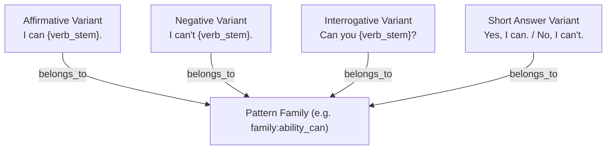
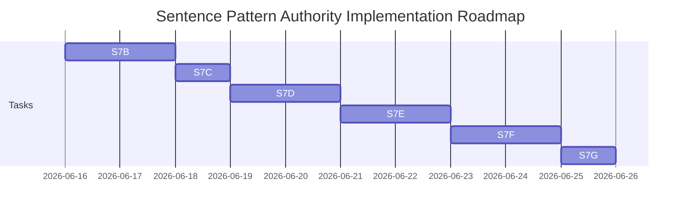

# ULGA-S7A Sentence Pattern Authority Design Scan

This report defines the design scan, architecture specifications, and implementation blueprint for the **Sentence Pattern Authority** (`ULGA-S7A`) under the ULGA framework. It establishes the schema, edge contracts, parent-variant family models, and an initial A1 Core Pattern scope to prepare for the implementation phase.

This task is a **Design Scan** only. No existing JSON graphs, source datasets, tests, or validators have been modified.

---

## 1. Executive Summary

### 1.1 Goal & Scope
The objective of this design scan is to lay the foundation for the **Sentence Pattern Authority**, the key layer responsible for translating abstract grammatical and lexical knowledge into production-ready language frames. This layer bridges the gap between syntactic rules (Grammar) and semantic collocations (Chunks/Vocabulary) to drive automated exercise generation, dialogue creation, and learner production mapping.

### 1.2 Differentiating Grammar and Sentence Pattern Authorities
Within the ULGA architecture, the Grammar and Sentence Pattern Authorities serve distinct, complementary roles:

*   **Grammar Authority (Abstract Rules)**: 
    *   Represents declarative grammatical knowledge (e.g., `grammar:GRAMMAR_NODE_000723` `"FORM: MODAL VERB 'CAN'"`, `grammar:GRAMMAR_NODE_001215` `"FORM: 'BE' + COMPLEMENT"`).
    *   Models structural rules, syntax restrictions, and inflection patterns as a graded, acyclic dependency DAG.
    *   *Limitation*: Contains no direct, fillable text structures or generation frames.
*   **Sentence Pattern Authority (Applied Frames)**:
    *   Represents procedural language production templates (e.g., `I can {verb_stem}.`, `Can you {verb_stem}?`, `I like {gerund/noun_phrase}`).
    *   Maps abstract grammatical rules to concrete, slot-based sentence structures.
    *   Binds slots to specific vocabulary constraints, chunk references, and thematic contexts.
*   **Cooperative Synergy**:
    *   Grammar provides the constraints and prerequisites, while Sentence Patterns provide the structural templates. Together, they enable targeted content generation (e.g. exercises, dialogues) and precise learner capability mapping.
    *   This combination allows the generator to construct grammatically valid items without needing complex, heavy-weight NLP parsers at runtime, and allows planners to recommend target practice models.

### 1.3 Verdict
**Final Verdict: PASS** (Ready to proceed to implementation task `ULGA-S7B`).

---

## 2. Current Project State

An inspection of the database structure reveals a robust, fully validated set of base layers:

*   **Mounted Node Count**:
    *   Grammar Nodes: **2,175**
    *   Vocabulary Nodes: **15,696**
    *   Chunk Nodes: **3,522**
    *   Theme Nodes: **28**
*   **Mounted Edge Count**:
    *   Chunk-Vocabulary Edges: **7,804**
    *   Vocabulary-Morphology Edges: **9,122**
    *   Vocabulary-Theme Edges: **19,557** (refined)
    *   Grammar Core Dependency Edges: **493**
*   **Chunk Grammar Metadata Layer (ULGA-S6H)**:
    *   Provides **3,522** records detailing chunk grammar signals, slots, and prerequisites.
    *   Contains **1,465** compiled **pattern seeds** (e.g., `{verb} sb to do sth`), which serve as the direct inputs for auto-generating sentence patterns.

---

## 3. Existing Assets Found

We searched the codebase for templates, generators, or schemas related to sentence patterns, confirming that:
1.  **`ulga_node_schema.json`**: Conforms to the `ULGA-S2` contract. It already registers the `"sentence_pattern"` prefix `pattern:` and the `sentence_pattern` `node_type`.
2.  **`chunk_grammar_metadata.json`** ([chunk_grammar_metadata.json](file:///G:/HomeWork/English_Learning_DB/ulga/graph/chunk_grammar_metadata.json)): Mapped in S6H, this file contains 1,465 pattern seeds detailing slot patterns and variables, serving as the foundational source dataset.
3.  **`chunk_grammar_metadata_rules.json`** ([chunk_grammar_metadata_rules.json](file:///G:/HomeWork/English_Learning_DB/ulga/rules/chunk_grammar_metadata_rules.json)): Mapped regex-based slot extraction patterns like `RULE_GRA_002_PLACEHOLDER_SLOT` and modal frames `RULE_GRA_001_MODAL_FRAME`.

There are currently **no** active `sentence_patterns.json`, pattern validators, generators, or sentence pattern test suites. These are flagged as missing and will be built in the next stages.

---

## 4. Missing Assets

To fully integrate the Sentence Pattern Authority, the following assets must be created in the `S7B` implementation phase:
1.  **`sentence_patterns.json`**: The core dataset storing all compiled SentencePatternNode records.
2.  **`sentence_pattern_edges.json`**: The dataset storing edges between patterns and other nodes.
3.  **`build_ulga_sentence_patterns.py`**: The automation builder script compiling pattern seeds and manually designed patterns into the unified database format.
4.  **`validate_ulga_sentence_patterns.py`**: The validator script ensuring node schema validity and referential integrity across the graph.
5.  **`test_ulga_sentence_patterns.py`**: Unit tests verifying the build pipeline, schema constraints, and edge constraints.

---

## 5. Proposed SentencePatternNode Schema

Every `SentencePatternNode` must conform to the unified `ulga_node_schema.json` (contract `ULGA-S2`). Custom metadata properties are nested inside the `metadata` block.

### 5.1 JSON Schema Specification (Metadata Subset)

```json
{
  "type": "object",
  "required": [
    "pattern_id",
    "canonical_pattern",
    "normalized_pattern",
    "pattern_family_id",
    "pattern_type",
    "difficulty_score",
    "slots",
    "grammar_refs",
    "vocabulary_slot_constraints",
    "chunk_refs",
    "theme_refs",
    "example_sentences",
    "generator_allowed",
    "validator_required",
    "source",
    "review_status"
  ],
  "properties": {
    "pattern_id": { "type": "string", "pattern": "^pattern:[A-Za-z0-9_.-]+$" },
    "canonical_pattern": { "type": "string" },
    "normalized_pattern": { "type": "string" },
    "pattern_family_id": { "type": "string", "pattern": "^family:[A-Za-z0-9_.-]+$" },
    "pattern_type": { "type": "string", "enum": ["affirmative", "negative", "interrogative", "short_answer", "declarative"] },
    "difficulty_score": { "type": "number", "minimum": 0.0, "maximum": 1.0 },
    "slots": {
      "type": "object",
      "additionalProperties": {
        "type": "object",
        "required": ["slot_key", "type", "form", "optional"],
        "properties": {
          "slot_key": { "type": "string" },
          "type": { "type": "string", "enum": ["verb", "noun", "adjective", "adverb", "pronoun", "preposition"] },
          "form": { "type": "string" },
          "optional": { "type": "boolean" }
        }
      }
    },
    "grammar_refs": { "type": "array", "items": { "type": "string" } },
    "vocabulary_slot_constraints": {
      "type": "object",
      "additionalProperties": {
        "type": "object",
        "properties": {
          "pos": { "type": "string" },
          "cefr_level_ceiling": { "type": "string" },
          "theme_filters": { "type": "array", "items": { "type": "string" } },
          "allowed_words": { "type": "array", "items": { "type": "string" } }
        }
      }
    },
    "chunk_refs": { "type": "array", "items": { "type": "string" } },
    "theme_refs": { "type": "array", "items": { "type": "string" } },
    "example_sentences": { "type": "array", "items": { "type": "string" } },
    "generator_allowed": { "type": "boolean" },
    "validator_required": { "type": "boolean" },
    "source": { "type": "string", "enum": ["manual_design", "chunk_pattern_seed", "hybrid_derived"] },
    "review_status": { "type": "string", "enum": ["draft", "approved", "review_required"] }
  }
}
```

### 5.2 Concrete Example Node

```json
{
  "id": "pattern:A1_ABILITY_CAN_YOU",
  "node_type": "sentence_pattern",
  "label": "Can you {verb_stem}?",
  "authority_source": {
    "source_name": "ULGA Sentence Pattern Authority",
    "source_file": "ulga/rules/sentence_patterns_source.json",
    "source_record_id": "SP_A1_004",
    "source_row": 4,
    "derivation": "manual_review"
  },
  "cefr_level": "A1",
  "confidence": {
    "value": 1.0,
    "method": "manual_review",
    "notes": ["A1 Core Ability Interrogative Pattern"]
  },
  "version": {
    "contract": "ULGA-S2",
    "source_version": "1.0.0",
    "generated_at": "2026-06-15T23:25:00Z"
  },
  "metadata": {
    "pattern_id": "pattern:A1_ABILITY_CAN_YOU",
    "canonical_pattern": "Can you {verb_stem}?",
    "normalized_pattern": "can you {verb}?",
    "pattern_family_id": "family:ability_can",
    "pattern_type": "interrogative",
    "difficulty_score": 0.15,
    "slots": {
      "{verb_stem}": {
        "slot_key": "{verb_stem}",
        "type": "verb",
        "form": "stem",
        "optional": false
      }
    },
    "grammar_refs": [
      "grammar:GRAMMAR_NODE_000488",
      "grammar:GRAMMAR_NODE_000492"
    ],
    "vocabulary_slot_constraints": {
      "{verb_stem}": {
        "pos": "verb",
        "cefr_level_ceiling": "A1",
        "theme_filters": ["action", "sports", "daily_activities"]
      }
    },
    "chunk_refs": [],
    "theme_refs": ["theme:ability"],
    "example_sentences": [
      "Can you swim?",
      "Can you run?",
      "Can you read?"
    ],
    "generator_allowed": true,
    "validator_required": true,
    "source": "manual_design",
    "review_status": "approved"
  }
}
```

---

## 6. Proposed Edge Contract

Sentence pattern relationships are represented via physical edges conforming to `ulga_edge_schema.json` (contract `ULGA-S2`).

| Logical Edge Type | Physical `edge_type` | Source Node Type | Target Node Type | Description / Semantic Rule |
| :--- | :--- | :--- | :--- | :--- |
| **`PATTERN_USES_GRAMMAR`** | `uses` | `sentence_pattern` | `grammar` | Links a pattern to the underlying grammatical rules it instantiates. |
| **`PATTERN_USES_VOCABULARY`** | `uses` | `sentence_pattern` | `vocabulary` | Direct binding of a pattern to a key lexeme (e.g. `like` or `can`). |
| **`PATTERN_USES_CHUNK`** | `uses` | `sentence_pattern` | `chunk` | Restricts slot contents to formulaic chunks rather than raw vocab words. |
| **`PATTERN_BELONGS_TO_THEME`** | `belongs_to` | `sentence_pattern` | `theme` | Links patterns to communicative topics for progression mapping. |
| **`PATTERN_PRECEDES_PATTERN`** | `prerequisite` | `sentence_pattern` | `sentence_pattern` | Sequence mapping where learning Pattern A is required before Pattern B. |
| **`PATTERN_VARIANT_OF`** | `belongs_to` | `sentence_pattern` | `sentence_pattern` | Connects a variant pattern node to a parent family node. |
| **`PATTERN_SUPPORTS_SKILL`** | `supports` | `sentence_pattern` | `skill` | Maps a pattern to communicative skills (e.g. speaking, writing). |

---

## 7. Pattern Family / Variant Model

To support systemic syntax transformations (affirmative, negative, interrogative, etc.), we proposed a hierarchical **Parent-Variant** model:



### 7.1 Architecture Details
1.  **Parent Family Node**: A logical grouping representing the core communicative competence.
2.  **Variant Nodes**: Concrete `SentencePatternNode` records. Modeling variants as independent nodes allows each variant to possess:
    *   Its own CEFR Level (e.g., interrogatives are often more difficult than affirmatives).
    *   Its own target grammatical links (e.g. interrogative links to `grammar:GRAMMAR_NODE_000488` Question form).
    *   Its own unique set of examples, slots, and validation parameters.
3.  **Variant Linkage**: Linked physically using `belongs_to` edges to the parent family node, or referenced dynamically via the `pattern_family_id` metadata attribute.

---

## 8. A1 Core Pattern Scope

The initial implementation stage will manually seed the following A1 core patterns:

### 8.1 Identity / Personal
*   **Pattern 1.1**: `I am {adjective/noun_phrase}.`
    *   *Slots*: `{adjective/noun_phrase}` (Type: adjective or noun)
    *   *Vocabulary/Theme Constraints*: Adjectives must be A1 level, filtered by `emotions` or `personal_descriptions`.
    *   *Linked Grammar*: `grammar:GRAMMAR_NODE_000718` (MAIN VERB 'BE')
    *   *Example*: *I am happy. / I am a student.*
*   **Pattern 1.2**: `My name is {name}.`
    *   *Slots*: `{name}` (Type: noun, proper)
    *   *Linked Grammar*: `grammar:GRAMMAR_NODE_000749` (DETERMINER + ADJECTIVE + NOUN)
    *   *Example*: *My name is John.*
*   **Pattern 1.3**: `I have {noun_phrase}.`
    *   *Slots*: `{noun_phrase}` (Type: noun)
    *   *Vocabulary/Theme Constraints*: Nouns must be A1 level, filtered by `school_supplies`, `pets`, or `possessions`.
    *   *Example*: *I have a dog. / I have a pencil.*

### 8.2 Preference
*   **Pattern 2.1**: `I like {noun_phrase/gerund}.`
    *   *Slots*: `{noun_phrase/gerund}` (Type: noun or gerund verb)
    *   *Vocabulary/Theme Constraints*: Filtered by `food_drinks`, `hobbies`, `animals`.
    *   *Linked Grammar*: `grammar:GRAMMAR_NODE_000670` (AFFIRMATIVE WITH 'LIKE'), `grammar:GRAMMAR_NODE_001196` ('LIKE' + '-ING')
    *   *Example*: *I like apples. / I like swimming.*
*   **Pattern 2.2**: `I don’t like {noun_phrase/gerund}.`
    *   *Slots*: `{noun_phrase/gerund}` (Type: noun or gerund verb)
    *   *Linked Grammar*: `grammar:GRAMMAR_NODE_001196` ('LIKE' + '-ING'), `grammar:GRAMMAR_NODE_000671` (PREFERENCES WITH 'LIKE')
    *   *Example*: *I don't like soccer. / I don't like reading.*

### 8.3 Ability
*   **Pattern 3.1**: `I can {verb_stem}.`
    *   *Slots*: `{verb_stem}` (Type: verb, form: stem)
    *   *Vocabulary/Theme Constraints*: Verbs must be A1 level, filtered by `action`, `sports`, `skills`.
    *   *Linked Grammar*: `grammar:GRAMMAR_NODE_000487` (CAN AFFIRMATIVE), `grammar:GRAMMAR_NODE_000492` (CAN ABILITY)
    *   *Example*: *I can swim. / I can run.*
*   **Pattern 3.2**: `Can you {verb_stem}?`
    *   *Slots*: `{verb_stem}` (Type: verb, form: stem)
    *   *Linked Grammar*: `grammar:GRAMMAR_NODE_000488` (CAN QUESTION), `grammar:GRAMMAR_NODE_000492` (CAN ABILITY)
    *   *Example*: *Can you cook? / Can you sing?*

### 8.4 Location / Existence
*   **Pattern 4.1**: `There is {noun_phrase}.`
    *   *Slots*: `{noun_phrase}` (Type: noun, count singular or uncountable)
    *   *Linked Grammar*: `grammar:GRAMMAR_NODE_001211` ('THERE IS')
    *   *Example*: *There is a cat. / There is milk.*
*   **Pattern 4.2**: `There is {noun_phrase} in/on/under {noun_phrase}.`
    *   *Slots*: `{noun_phrase_1}` (Type: noun), `{noun_phrase_2}` (Type: noun)
    *   *Vocabulary/Theme Constraints*: Prefiltered preposition tokens.
    *   *Linked Grammar*: `grammar:GRAMMAR_NODE_001211` ('THERE IS')
    *   *Example*: *There is a book on the table.*
*   **Pattern 4.3**: `Where is {noun_phrase}?`
    *   *Slots*: `{noun_phrase}` (Type: noun)
    *   *Linked Grammar*: `grammar:GRAMMAR_NODE_001129` (MAIN VERB 'BE' A2 question), conceptually maps location.
    *   *Example*: *Where is the bathroom?*

### 8.5 Daily Routine
*   **Pattern 5.1**: `I {verb_stem} every day.`
    *   *Slots*: `{verb_stem}` (Type: verb, form: stem)
    *   *Vocabulary/Theme Constraints*: Filtered by `daily_activities`, `routines`.
    *   *Example*: *I study every day. / I exercise every day.*
*   **Pattern 5.2**: `I {verb_stem} at {time}.`
    *   *Slots*: `{verb_stem}` (Type: verb, form: stem), `{time}` (Type: adverb/time phrase)
    *   *Example*: *I sleep at 10 PM. / I eat at noon.*

### 8.6 Request / Classroom
*   **Pattern 6.1**: `Can I have {noun_phrase}?`
    *   *Slots*: `{noun_phrase}` (Type: noun)
    *   *Linked Grammar*: `grammar:GRAMMAR_NODE_000495` (CAN REQUESTS)
    *   *Example*: *Can I have water? / Can I have a pen?*
*   **Pattern 6.2**: `May I {verb_stem}?`
    *   *Slots*: `{verb_stem}` (Type: verb, form: stem)
    *   *Linked Grammar*: `grammar:GRAMMAR_NODE_000495` (CAN/MAY REQUESTS)
    *   *Example*: *May I leave? / May I write?*

### 8.7 Description
*   **Pattern 7.1**: `It is {adjective}.`
    *   *Slots*: `{adjective}` (Type: adjective)
    *   *Vocabulary/Theme Constraints*: Filtered by `weather`, `feelings`, `sizes`.
    *   *Example*: *It is cold. / It is big.*
*   **Pattern 7.2**: `This is {noun_phrase}.`
    *   *Slots*: `{noun_phrase}` (Type: noun)
    *   *Linked Grammar*: `grammar:GRAMMAR_NODE_000326` ('THIS' POINTING)
    *   *Example*: *This is a phone. / This is my book.*
*   **Pattern 7.3**: `That is {noun_phrase}.`
    *   *Slots*: `{noun_phrase}` (Type: noun)
    *   *Linked Grammar*: `grammar:GRAMMAR_NODE_000326` ('THIS' / 'THAT' POINTING)
    *   *Example*: *That is a bird. / That is his car.*

---

## 9. Validator Requirements

The validator `validate_ulga_sentence_patterns.py` must enforce the following validation constraints:

1.  **Identifier Check**: Every pattern node must have an ID starting with `pattern:`.
2.  **Metadata Integrity**: Enforce non-null/non-empty values for `canonical_pattern`, `pattern_family_id`, `difficulty_score`, `grammar_refs`, `slots`, and `review_status`.
3.  **Slot Consistency**: Every slot placeholder token (e.g. `{verb_stem}`) present in the `canonical_pattern` string must have a matching entry in the `slots` schema dictionary.
4.  **CEFR Ceiling Alignment**: Enforce that the pattern's declared `cefr_level` is greater than or equal to:
    *   The `cefr_level` of all grammar nodes referenced in `grammar_refs`.
    *   The `cefr_level` of any static chunk references in `chunk_refs`.
5.  **Referential Integrity**: Verify that all `grammar_refs`, `chunk_refs`, and `theme_refs` target valid, existing node IDs in the compiled graph.
6.  **Acyclic Dependencies**: The pattern-to-pattern prerequisite DAG (`PATTERN_PRECEDES_PATTERN` / `prerequisite` edges) must be verified as acyclic (no loops).

---

## 10. Generator Requirements

The pattern compiler `build_ulga_sentence_patterns.py` will generate patterns through the following pipeline:

1.  **Parse Pattern Seeds**: Extract the 1,465 pattern seeds from `chunk_grammar_metadata.json` and generate candidate `SentencePatternNode` objects for review.
2.  **Inject Core Patterns**: Hardcode the A1 core pattern variants defined in this design document.
3.  **Resolve Morphological Slots**: Integrate with the morphology layer to map base lexeme stems to slot variables (e.g., if a slot requires `{verb_third_person}`, the builder binds it to vocabulary base lemmas and uses the morphology graph to generate surface strings).
4.  **Refine Theme and Level Bindings**: Automatically copy target theme tags from vocabulary nodes anchored in the pattern slots.
5.  **Write Compiled Graph**: Output `sentence_patterns.json` and the corresponding edges dataset.

---

## 11. Risk Assessment

*   **Risk 1: Grammatical Agreement & Slot Mismatches (Polysemy)**
    *   *Detail*: A noun slot `{noun}` could get filled with singular nouns causing number agreement issues (e.g., "I like apple" vs "I like apples").
    *   *Mitigation*: Implement strict slot typing (e.g. `{noun_plural}`, `{noun_uncountable}`) and map these explicitly in the validator.
*   **Risk 2: CEFR Level Discrepancy**
    *   *Detail*: EGP labels `be going to` (`grammar:GRAMMAR_NODE_000414`) as B1 level, whereas standard textbooks teach it at A1/A2.
    *   *Mitigation*: Establish a "pedagogical progression level override" in the planner config so that the curriculum sequence bypasses EGP rigidness.
*   **Risk 3: Combinatorial Generation Bloat**
    *   *Detail*: Randomly filling a slot can yield nonsensical sentences (e.g. "I can sleep the mountain").
    *   *Mitigation*: Restrict slots via vocabulary theme filters (`theme_filters`) to ensure semantic compatibility.

---

## 12. S7B ~ S7G Recommended Roadmap



*   **`ULGA-S7B`**: Implement builder script (`build_ulga_sentence_patterns.py`) to output pattern nodes and edges.
*   **`ULGA-S7C`**: Implement validator and pytest unit tests.
*   **`ULGA-S7D`**: Link patterns to specific vocabulary pools and theme topics.
*   **`ULGA-S7E`**: Integrate sentence patterns into the exercise generator runtime.
*   **`ULGA-S7F`**: Expand patterns to support multi-turn dialogue templates.
*   **`ULGA-S7G`**: Perform final QA Audit and close out task.

---

## 13. Verdict

**Final Verdict: PASS**

The design specifications, schema requirements, parent-family model, edge contract, and initial A1 scope are fully defined and aligned with the `ULGA-S2` contract rules. We recommend proceeding directly to the implementation phase `ULGA-S7B`.
